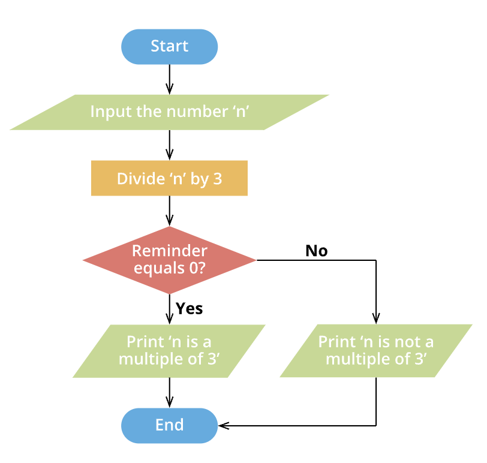
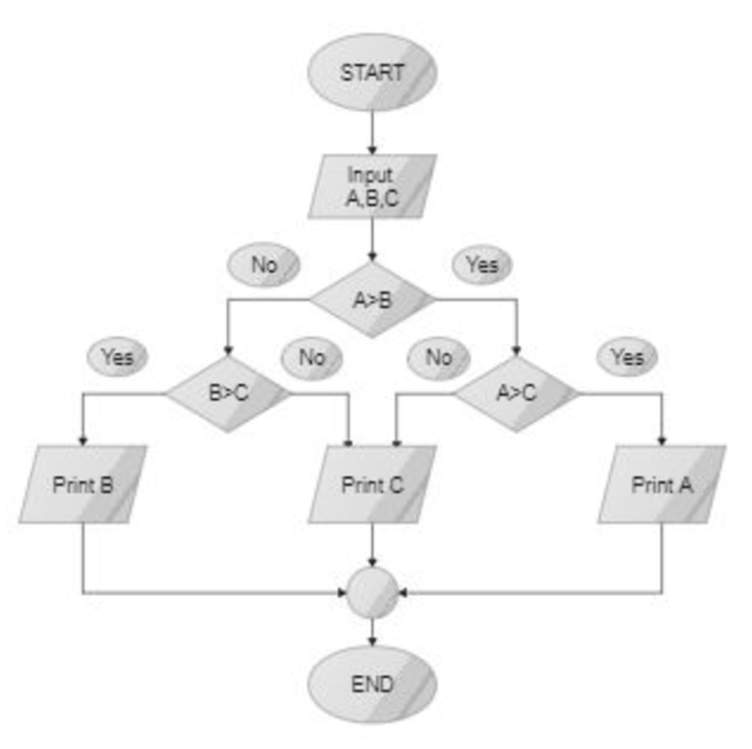

<div style="display: flex; width: 100%;">
    <div style="flex: 1; padding: 0px;">
        <p>© Albert Palacios Jiménez, 2023</p>
    </div>
    <div style="flex: 1; padding: 0px; text-align: right;">
        
    </div>
</div>
<hr/>

# Condicions

Les condicions permeten decidir si un troç de codi s'executa en funció d'una condició.

## If/else

Un **if** comprova si una condició és certa o no. 

- Si és certa, s'executa el codi dins del bloc if. 
- Si no és certa, el programa pot passar al següent bloc opcional
- El bloc sense condició **else** s'executa quan la condició inicial és falsa

```java
if (numero > 0) {
    System.out.println("El número és positiu.");
} else if (numero < 0) {
    System.out.println("El número és negatiu.");
} else {
    System.out.println("El número és igual a zero.");
}
```

### Exercici 0500

Modifica el codi de:

```bash
src/main/exercici0500/Main.java
```

Per fer que quan s'executa el programa amb:

```bash
./run.sh com.exercici0500.Main
```

Demani els valors numèrics de 'a' i 'b', i faci la funció *mesGranQueA5* segons el següent diagrama.

```java
public static boolean mesGranQueA5(float a, float b)
```

<center>

</center>

### Exercici 0501

Modifica el codi de:

```bash
src/main/exercici0501/Main.java
```

Per fer que quan s'executa el programa amb:

```bash
./run.sh com.exercici0501.Main
```

Demani el valor numèric de 'n', i faci la funció *MultipleOf3* segons el següent diagrama.

```java
public static boolean multipleOf3(float n)
```

<center>

</center>

### Exercici 0502

Modifica el codi de:

```bash
src/main/exercici0502/Main.java
```

Per fer que quan s'executa el programa amb:

```bash
./run.sh com.exercici0502.Main
```

Demani els valors de 'a', 'b', 'c' , i faci la funció *maxOfThree* segons el següent diagrama.

```java
public static float maxOfThree(float a, float b, float c)
```

<center>

</center>

### Exercici 0503

Modifica el codi de:

```bash
src/main/exercici0503/Main.java
```

Per fer que quan s'executa el programa amb:

```bash
./run.sh com.exercici0503.Main
```

Demani el valor el nom de l'usuari i retorni si comença per vocal o per consonant.

```java
public static boolean startsWithVowel(String word)
```

## Operador ternari

L'**operador ternari** és un tipus de condició similar a **if/else** però que s'escriu en una sola linia amb aquesta estructura:

```text
condició ? valorSiCert : valorSiFals;
````

Això permet estalviar codi per condicions senzilles.

Exemple:

```java
int edat = 20;
String resultat = (edat >= 18) ? "Major d'edat" : "Menor d'edat";
System.out.println(resultat);
```

### Exemple 0500

Fes anar aquest exemple amb:

```bash
./run.sh com.exemple0500.Main
```

```java
package com.exemple0500;

import java.util.Scanner;

public class Main {
public static void main(String[] args) {

        Scanner scanner = new Scanner(System.in);

        // Demanar tres números a l'usuari
        System.out.print("Escriu el primer número: ");
        int num1 = scanner.nextInt();

        System.out.print("Escriu el segon número: ");
        int num2 = scanner.nextInt();

        System.out.print("Escriu el tercer número: ");
        int num3 = scanner.nextInt();

        // Determinar el més gran amb operadors ternaris
        int max = (num1 > num2) ? 
                     ((num1 > num3) ? num1 : num3) : 
                     ((num2 > num3) ? num2 : num3);

        // Mostrar el resultat
        System.out.println("El número més gran és: " + max);

        scanner.close();
    }
}
```

### Exercici 0504

Modifica el codi de:

```bash
src/main/exercici0504/Main.java
```

Per fer que quan s'executa el programa amb:

```bash
./run.sh com.exercici0504.Main
```


Retorni el número més petit fent servir **l'operador ternari** amb una funció que es digui **minOfThree**

```java
public static float minOfThree(float a, float b, float c)
```

```text
Escriu el primer número: 4
Escriu el segon número: 1
Escriu el tercer número: 2
El número més petit és: 1
```

## Switch

L'estructura **switch** és una eina que permet prendre decisions basades en el valor d'una variable o expressió. 

És útil quan hi ha múltiples opcions possibles, perquè fa el codi més net i llegible:

Les parts de l'estructura **switch** són:

- **expressió**: Pot ser un valor enter, caràcter (char), String, o un enum.
- **case**: Defineix un valor específic a comparar amb l'expressió.
- **break**: Surt del switch després d'executar el codi d'un cas 
- **default**: Opcional, s'executa si cap cas coincideix.

```java
switch (expressió) {
    case valor1:
        // Codi a executar si expressió == valor1
        break;
    case valor2:
        // Codi a executar si expressió == valor2
        break;
    default:
        // Codi a executar si cap cas coincideix
        break;
}
```

**Important**: En **Java** si no es posa **break**, el programa continuarà pel següent **case** com si el valor també coincidís.

### Exemple 0501

Fes anar aquest exemple amb:

```bash
./run.sh com.exemple0501.Main
```

```java
package com.exemple0501;

import java.util.Scanner;

public class Main {
public static void main(String[] args) {
        Scanner scanner = new Scanner(System.in);

        // Demanar el número del dia a l'usuari
        System.out.print("Escriu un número del 1 al 7 per representar un dia de la setmana: ");
        int dia = scanner.nextInt();

        // Determinar el dia de la setmana amb un switch
        switch (dia) {
            case 1:
                System.out.println("Dilluns");
                break;
            case 2:
                System.out.println("Dimarts");
                break;
            case 3:
                System.out.println("Dimecres");
                break;
            case 4:
                System.out.println("Dijous");
                break;
            case 5:
                System.out.println("Divendres");
                break;
            case 6:
            case 7:
                System.out.println("Cap de setmana");
                break;
            default:
                System.out.println("Número no vàlid. Has d'escriure un valor entre 1 i 7.");
                break;
        }

        scanner.close();
    }
}
```

### Exercici 0505

Modifica el codi de:

```bash
src/main/exercici0505/Main.java
```

Per fer que quan s'executa el programa amb:

```bash
./run.sh com.exercici0505.Main
```

Demani un número de mes de l'any i retorni el seu nom amb la funció *"nomDelMes"*

```java
public static String nomDelMes(int valor)
```

```text
Escri un número de mes de l'any: 2
"Febrer" és el mes número 2
```

### Exercici 0506

Modifica el codi de:

```bash
src/main/exercici0506/Main.java
```

Per fer que quan s'executa el programa amb:

```bash
./run.sh com.exercici0506.Main
```

Demani dos números a l'usuari i una operació matemàtica (suma, resta, multiplicació o divisió) a través de la funció **"calculadora"** que rep com a paràmetres la operació i dos valors:

```java
public static float calculadora(char operacio, float a, float b)
```

- El programa ha d'utilitzar un switch per executar l'operació i mostrar el resultat.

Requisits:
- L'operació s'indica amb un símbol (+, -, *, /).
- Gestiona la divisió per zero mostrant un missatge d'error.
- Mostra un missatge d'error si l'operació no és vàlida.

Exemples de sortida:

```text
Escriu el primer número: 10
Escriu el segon número: 5
Escriu l'operació (+, -, *, /): *
El resultat és: 50
```

```text
Escriu el primer número: 10
Escriu el segon número: 0
Escriu l'operació (+, -, *, /): /
Error: No es pot dividir per zero.
```

```text
Escriu el primer número: 10
Escriu el segon número: 5
Escriu l'operació (+, -, *, /): ^
Error: Operació no vàlida.
```

### Exercici 0507

Modifica el codi de:

```bash
src/main/exercici0507/Main.java
```

Per fer que quan s'executa el programa amb:

```bash
./run.sh com.exercici0507.Main
```

Demani a l'usuari la seva edat i la classifica segons:

```text
0-12 anys: Nen
13-17 anys: Adolescent
18-64 anys: Adult
65 anys o més: Jubilat
```

- Si l'edat no és positiva, mostra un missatge d'error.
