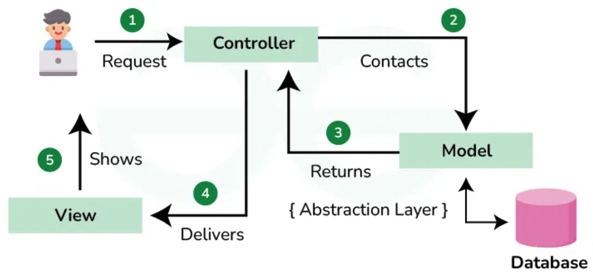
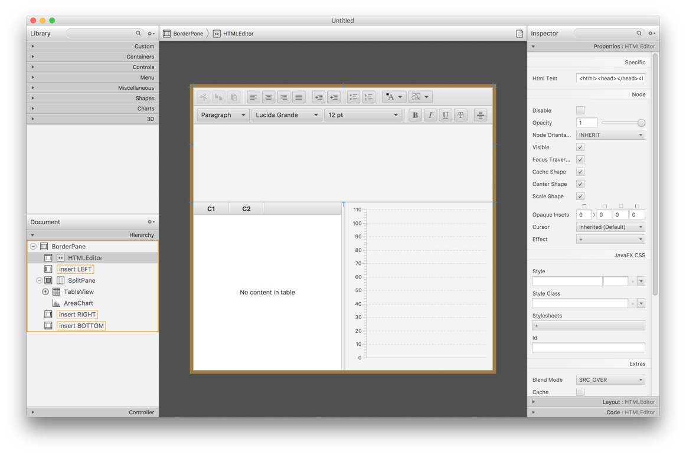
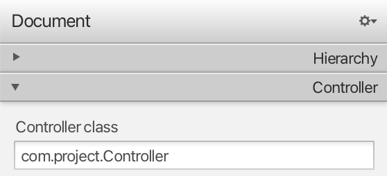
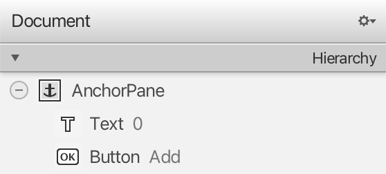
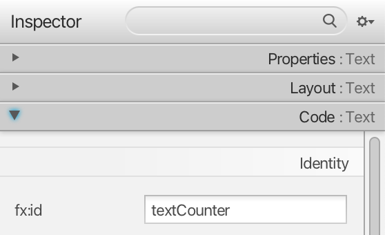
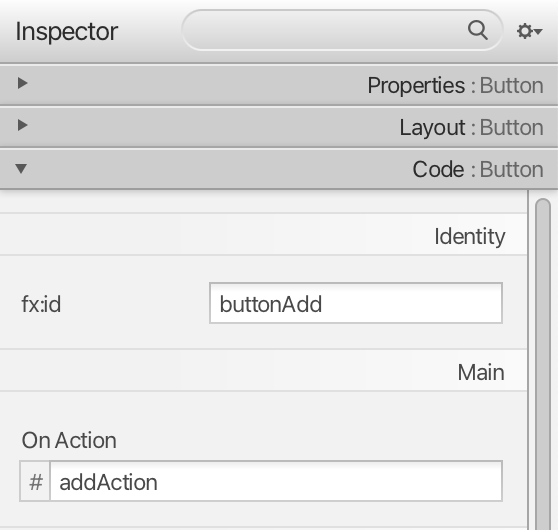
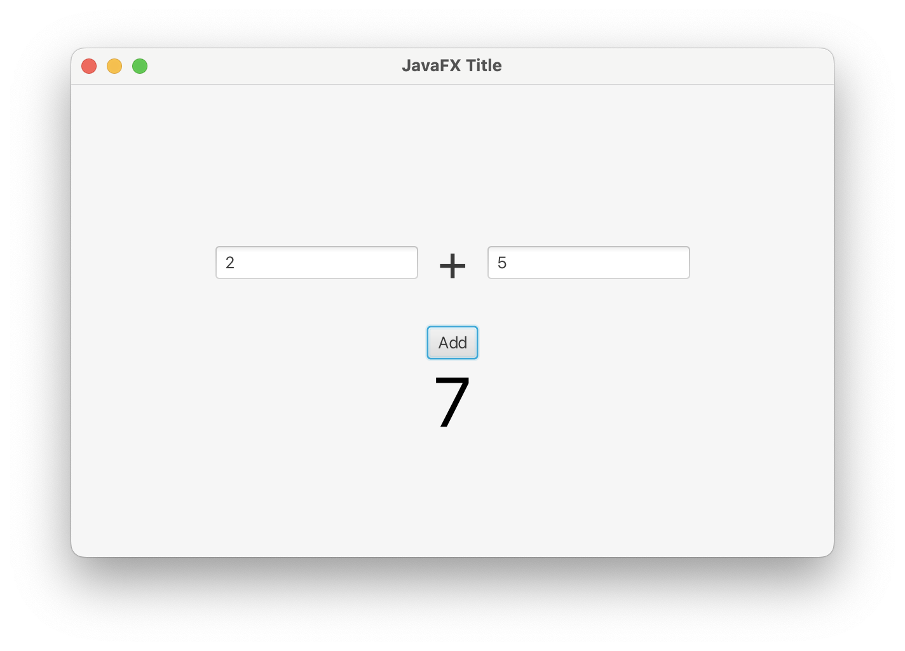

<div style="display: flex; width: 100%;">
    <div style="flex: 1; padding: 0px;">
        <p>© Albert Palacios Jiménez, 2023</p>
    </div>
    <div style="flex: 1; padding: 0px; text-align: right;">
        
    </div>
</div>
<br/>

# JavaFX (1)

JavaFX és una tecnología per crear aplicacions interactives.

<center>
<br/></center>
<br/>

Originalment estava pensat per crear aplicacions web, però principalment serveix per crear aplicacions d’escriptori.

## Model-Vista-Controlador (MVC)

Les aplicacions de JavaFX segueixen l’estructura MVC, divideixen el codi en tres capes diferents:

- **Model:** Gestiona l’estat i les dades de l’aplicació
- **Vista:** Defineix l’estructura visual de l’aplicació
- **Controlador:** Defineix la interacció i el funcionament de l’aplicació

<center>
<br/></center>
<br/>

### Vistes FXML

JavaFX defineix les vistes (les interfícies visuals), a partir de codi FXML.

El codi FXML està basat en arxius de text amb format XML, per tant, es poden editar manualment.

```xml
<?xml version="1.0" encoding="UTF-8"?>
<?import javafx.scene.control.Button?>
<?import javafx.scene.layout.AnchorPane?>
<?import javafx.scene.text.Font?>
<?import javafx.scene.text.Text?>
<AnchorPane prefHeight="400.0" prefWidth="600.0" xmlns="http://javafx.com/javafx/22" xmlns:fx="http://javafx.com/fxml/1" fx:controller="com.project.Controller">
   <children>
      <Text fx:id="textCounter" layoutX="25.0" layoutY="220.173828125" strokeType="OUTSIDE" strokeWidth="0.0" text="0" textAlignment="RIGHT" wrappingWidth="285.13671875" AnchorPane.leftAnchor="25.0" AnchorPane.topAnchor="167.0">
         <font>
            <Font name="Lato Black" size="55.0" />
         </font>
      </Text>
      <Button fx:id="buttonAdd" layoutX="417.0" layoutY="187.0" mnemonicParsing="false" onAction="#actionAdd" text="Add" />
   </children>
</AnchorPane>
```

## Gluon SceneBuilder

Editar interfícies FXML manualment és complicat, ja que cal conèixer els components del llenguatge. 

[Gluon](https://gluonhq.com/products/scene-builder/) és una eina que permet crear i editar arxius FXML de manera visual.

<center>
<br/></center>
<br/>

**Nota:** Descarregueu [Gluon SceneBuilder](https://gluonhq.com/products/scene-builder/#download) per editar arxius *.fxml*

A **Ubuntu** pot ser que calgui fer:
```bash
wget http://es.archive.ubuntu.com/ubuntu/pool/main/libf/libffi/libffi7_3.3-4_amd64.deb
sudo dpkg -i libffi7_3.3-4_amd64.deb
sudo apt --fix-broken install
sudo apt install libpcre3
sudo dpkg -i SceneBuilder-23.0.1.deb
```

### Gluon, relacionar el controlador i la vista

El controlador correspon a una clase Java, que interactua amb els elements de la vista FXML.

És a dir, llegeix el valor dels camps del formulari, canvía valors dels elements, …

A Gluon, cal definir quin controlador s’encarrega de l’arxiu que s’està definint.

<center>
<br/></center>
<br/>

Per poder relacionar els elements dels arxius FXML (creats amb Gluon SceneBuilder) i els objectes/atributs/funcions dels sues controladors, fem servir anotacions "@FXML" al codi Java.

```java
package com.project;

import javafx.fxml.FXML;
import javafx.scene.control.Button;
import javafx.scene.text.Text;
import javafx.event.ActionEvent;

public class Controller {

    @FXML
    private Button buttonAdd;

    @FXML
    private Text textCounter;

    private int counter = 0;

    @FXML
    private void actionAdd(ActionEvent event) {
        counter++;
        textCounter.setText(String.valueOf(counter));
    }
}
```

En el codi anterior, la vista FXML que fa servir *Controller0* té 3 buttons, que criden a dues funcions.

### Models a JavaFX

La part del model que conté l’estat de l’aplicació i les dades, s’ha de definir segons convingui a l’usuari.

Normalment es farà amb Singleton i objectes DAO per comunicar-se amb una base de dades.

## Projectes Maven amb JavaFX

En un projecte JavaFX amb Maven, els arxius *.java* són a:

```bash
src/main/java/com/project
```

I els arxius *.fxml* a la carpeta:

```bash
src/main/resources/assets
```

**Nota:** A la carpeta *assets* també hi posem altres arxius que s'empaqueten amb l'aplicació.

### Exemple 1600

Fes anar l'exemple amb:

```bash
./run.sh com.exemple1600.Main
```

Aquest exemple mostra com: 

- Es relaciona una vista i el seu controlador.
- S'executen accions des de la vista.
- S'actualitza la vista des del controlador.

La vista està definida a l'arxiu *src/resources/assets/layout.fxml*:

```xml
<!-- Defineix el controlador amb fx:controller -->
<AnchorPane ... fx:controller="com.project.Controller">
    <!-- Per poder modificar el text que mostra, defineix fx:id  -->
    <Text fx:id="textCounter" ...></Text>
    <!-- Per identificar el botó dels del codi, defineix fx:id -->
    <!-- Per executar la funció 'actionAdd' quan s'apreta el botó, defineix 'onAction' -->
    <Button fx:id="buttonAdd" ... onAction="#actionAdd"/>
   </children>
</AnchorPane>
```

A *Gluon SceneBuilder* les configuracions anteriors es veuen a:

**Jerarquia d'objectes de la vista:** secció 'Document' apartat 'Hierarchy'

<center>
<br/></center>
<br/>

**Controlador:** secció 'Document', apartat 'Controller' i valor 'Controller class'

<center>
<br/></center>
<br/>

**Nota** a l'exemple el controlador és: *"com.exemple1600.Controller"*


**Identificador dels elements al codi:** apartat 'Code' valor 'fx:id'

<center>
<br/></center>
<br/>

**Acccions dels elements:** apartat 'Code' valor  'On Action'

<center>
<br/></center>
<br/>

**Nota:** A Windows fer servir './run.ps1'

### Exercici 1600

Modifica l'exemple 1600 per afegir un botó de restar.

Fes anar l'exercici amb:

```bash
./run.sh com.exercici1600.Main
```

### Exercici 1601

Modifica el codi per fer un programa que fa una suma a partir de dos camps de text:

Fes anar l'exercici amb:

```bash
./run.sh com.exercici1601.Main
```

<center>
<br/></center>
<br/>

### Exercici 1602

Modifica el codi per fer un programa que té un "titol" i un "text" i permet guardar la informació a un arxiu "./data/dades1601.json"

Després afegeix un botó "Carregar" que llegeix les dades de l'arxiu *.json* anterior i les mostra als camps del programa.

Fes anar l'exercici amb:

```bash
./run.sh com.exercici1601.Main
```
