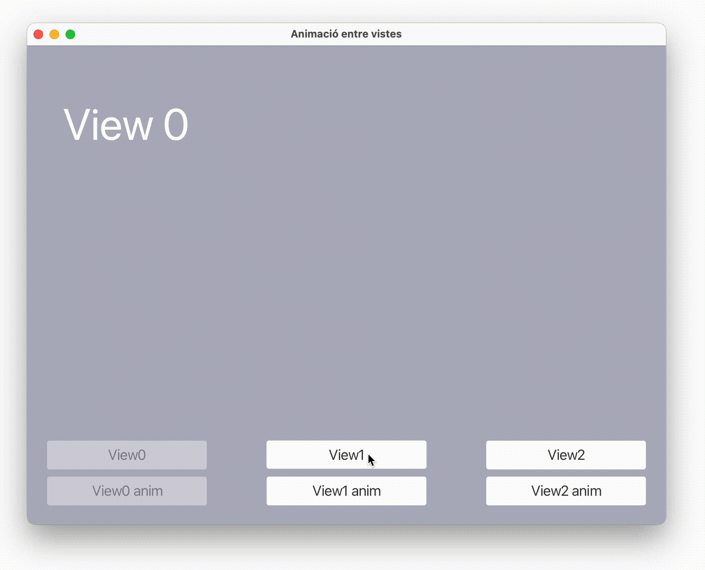

<div style="display: flex; width: 100%;">
    <div style="flex: 1; padding: 0px;">
        <p>© Albert Palacios Jiménez, 2023</p>
    </div>
    <div style="flex: 1; padding: 0px; text-align: right;">
        
    </div>
</div>
<br/>

# JavaFX (3)

## Vistes

A **JavaFX** la gestió de Vistes amb JavaFX cal fer-la des del codi manualment. Aquesta gestió no és complicada però es pot fer pesada.

La classe **'UtilsViews.java'** permet gestionar un conjunt de vistes de manera senzilla.

## Exemple 1601

L'exemple '0101' fa servir *'UtilsViews'* per mostrar el canvi entre diferents vistes.

Al main, s'afegeixen les vistes a l'escena. Al afegir cada vista se li dóna un nom (View0, View1, ...) per poder-les referenciar més endavant:

```java
UtilsViews.parentContainer.setStyle("-fx-font: 14 arial;");
UtilsViews.addView(getClass(), "View0", "/assets/exemple1601View0.fxml");
UtilsViews.addView(getClass(), "View1", "/assets/exemple1601View1.fxml");
UtilsViews.addView(getClass(), "View2", "/assets/exemple1601View2.fxml");

Scene scene = new Scene(UtilsViews.parentContainer);
```

Com que UtilsViews és té atributs i funcions estàtiques, es poden cridar des de qualsevol controlador. Per exemple, des de *Controller0':

```java
@FXML
private void toView2(ActionEvent event) {
    UtilsViews.setView("View2");
}

@FXML
private void animateToView0(ActionEvent event) {
    UtilsViews.setViewAnimating("View0");
}
```

En el codi anterior:

- **UtilsViews.setView("View2")** canvia a la vista 'View2' sense animació
- **UtilsViews.setViewAnimating("View0")** canvia de vista 'View0' amb animació

<center>
<br/></center>
<br/>

Com que **UtilsViews* fa servir atributs i mètodes estàtics, podem obtenir el controlador d'una vista a partir del seu identificador:

```java
// Cal fer cast/transformar al tipus del controlador que s'obté (nom de l'objecte)
Controller0 ctrl0 = (Controller0) UtilsViews.getController("View0");
```

## Subvistes


