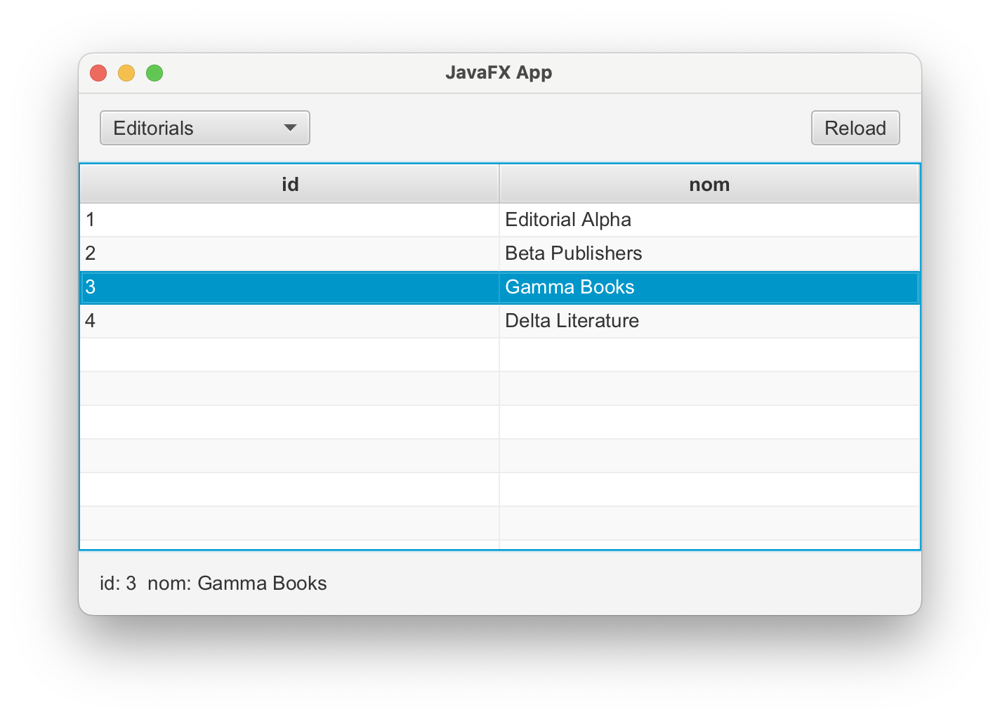

<div style="display: flex; width: 100%;">
    <div style="flex: 1; padding: 0px;">
        <p>© Albert Palacios Jiménez, 2023</p>
    </div>
    <div style="flex: 1; padding: 0px; text-align: right;">
        
    </div>
</div>
<br/>

# JavaFX (4)

## DDBB i taules amb dades

La interacció amb bases de dades es fa igual que amb les aplicacions de text.

Enlloc d'aturar la connexió amb la base de dades al final del main, s'ha d'aturar quan es tanca l'aplicació. A JavaFX la funció **stop()** es crida quan l'usuari tanca l'aplicació:

```java
    @Override
    public void stop() throws Exception {
        AppData db = AppData.getInstance();
        db.close();
        super.stop();
    }
```

## Exemple 1607

Cal escollir un arxiu **".sqlite"** al iniciar l'aplicació. 

<center>
<br/></center>
<br/>

Quan s'escull un arxiu **".sqlite"**:

- S'obre la connexió amb la base de dades
- Es carrega la informació de les taules (sense cap sel·lecció de taula o fila)
- Es canvia a la vista "ViewTaula"

```java
    @FXML
    public void selectFile(ActionEvent event) {
        // Escollir un arxiu "*.sqlite*
        Stage stage = (Stage) buttonSelectFile.getScene().getWindow();
        FileChooser fileChooser = new FileChooser();
        fileChooser.setInitialDirectory(new File(System.getProperty("user.dir")));
        fileChooser.getExtensionFilters().add(new FileChooser.ExtensionFilter("Arxius .sqlite", "*.sqlite"));
        File selectedFile = fileChooser.showOpenDialog(stage);
        if (selectedFile != null) {
            // Obrir connexió amb la base de dades
            AppData db = AppData.getInstance();
            db.connect(selectedFile.toPath().toString());

            // Carregar la informació de les taules (sense sel·lecció)
            ControllerTaula ctrlTaula = (ControllerTaula) UtilsViews.getController("ViewTaula");
            ctrlTaula.loadTables("", -1);

            // Canviar a la vista "ViewTaula"
            UtilsViews.setViewAnimating("ViewTaula");
        }
    }
```

Al iniciar la vista, es defineix que el **'CoiceBox'** canvii les dades de la taula **'TableView'** quan l'usuari canvia d'opció. Això es fa a la funció **initialize**:

```java
    @Override
    public void initialize(URL url, ResourceBundle rb) {

        // Acció que s'executa quan el 'coiceBox' canvia de valor
        choiceBox.setOnAction((event) -> {
            String selectedTable = choiceBox.getSelectionModel().getSelectedItem();
            // La selecció pot ser 'null' quan es reconstrueix el 'choiceBox'
            if (selectedTable != null) {
                setTable(selectedTable);
            }
        });
    }
```

La funció **loadTables** llista les taules disponibles a la base de dades, al **ChoiceBox**.

A més, si ja hi ha una taula i una fila escollides, intenta mantenir la sel·lecció:

```java
public void loadTables(String selectedTable, int selectedRow) {
        // Obtenir el nom de les taules de la base de dades
        AppData db = AppData.getInstance();
        String sql = "SELECT name FROM sqlite_master WHERE type='table' AND name <> 'sqlite_sequence'";
        ArrayList<HashMap<String, Object>> rows = db.query(sql);
        
        // Posar els noms de les taules a 'tableNames'
        ArrayList<String> tableNames = new ArrayList<>();
        for (HashMap<String, Object> row : rows) {
            tableNames.add((String) row.get("name"));
        }

        // Posar els noms de les taules a la 'choiceBox'
        choiceBox.getItems().clear();
        choiceBox.getItems().addAll(tableNames);

        if (selectedTable.equalsIgnoreCase("") == false && tableNames.indexOf(selectedTable) != -1) {
            // Escollir la taula 'selectedTable'
            choiceBox.getSelectionModel().select(selectedTable);
            setTable(selectedTable);

            // Escollir la fila 'selectedRow'
            if (selectedRow >= 0 && selectedRow < table.getItems().size()) {
                table.getSelectionModel().select(selectedRow);
            }
        } else {
            // Escollir la primera taula
            choiceBox.getSelectionModel().selectFirst();
            setTable(tableNames.get(0));
        }
    }
```

Quan es mostren les dades d'una taula a la **'TableView'**:

- Es defineixen les columnes de la taula
- Es posen les dades a la taula
- Es defineix la taula com editable
- Es defineix què cal fer quan es modifica una fila

```java
private void setTable(String tableName) {

        // Vigilar que hi ha un 'tableName'
        if (tableName == null || tableName.trim().isEmpty()) {
            System.out.println("La taula seleccionada és null o buida.");
            return;
        }

        // Obtenir els continguts de la taula
        AppData db = AppData.getInstance();
        String sql = "SELECT * FROM " + tableName;
        ArrayList<HashMap<String, Object>> rows = db.query(sql);

        // Esborrar les columnes i files actuals de la taula
        table.getColumns().clear();
        table.getItems().clear();

        if (!rows.isEmpty()) {

            // Determinar els noms de les columnes
            HashMap<String, Object> firstRow = rows.get(0);
            for (String key : firstRow.keySet()) {
                TableColumn<HashMap<String, Object>, Object> column = new TableColumn<>(key);
                column.setCellValueFactory(cellData -> new SimpleObjectProperty<>(cellData.getValue().get(key)));
                table.getColumns().add(column);
            }

            // Ajustar l'amplada de cada columna de manera equitativa
            table.getColumns().forEach(column ->
                column.prefWidthProperty().bind(table.widthProperty().divide(table.getColumns().size()))
            );
        }

        // Assignar les dades a la taula
        ObservableList<HashMap<String, Object>> data = FXCollections.observableArrayList(rows);
        table.setItems(data);

        // Afegir listener per detectar la selecció d'una fila
        table.getSelectionModel().selectedItemProperty().addListener((obs, oldSelection, newSelection) -> {
            setLabelInfo(newSelection);
        });

        // Fer la taula editable
        makeTableEditable(table, row -> {
            String selectedTable = choiceBox.getSelectionModel().getSelectedItem();

            // Definir el nom de la clau primària, segons la taula
            String keyName = "id";
            if (tableName.equals("Llibres")) {
                keyName = "id_llibre";
            }
            boolean modified = setModifiedRow(selectedTable, keyName, row);
            if (modified) {
                setLabelInfo(row);
            }
        });
    }
```

La funció **reload** re-carrega les dades de la base de dades, intenta mantenir la sel·lecció de la taula i fila escollides:

```java
public void reload(ActionEvent event) {
        String selectedTable = choiceBox.getSelectionModel().getSelectedItem();
        int selectedRow = table.getSelectionModel().getSelectedIndex();

        loadTables(selectedTable, selectedRow);
    }
```

La funció **setLabelInfo** mostra la informació de la fila escollida al **'Label'** de la part inferior de l'aplicació:

```java
private void setLabelInfo(HashMap<String, Object> rowData) {
        if (rowData == null) {
            label.setText("Cap fila escollida");
        } else {
            StringBuilder info = new StringBuilder();
            rowData.forEach((key, value) -> info.append(key).append(": ").append(value).append("  "));
            label.setText(info.toString());
        }
    }
```

La funció **setModifiedRow** guarda les modificacions que s'han fet a una fila, a la base de dades:

```java
private boolean setModifiedRow(String tableName, String keyName, HashMap<String, Object> rowData) {

        if (rowData == null || tableName == null) return false;

        Object idValue = rowData.get(keyName);
        if (!(idValue instanceof Integer)) {
            System.out.println("No es pot actualitzar: no hi ha clau primària '" + keyName + "'");
            return false;
        }
    
        StringBuilder setClause = new StringBuilder();
        for (String key : rowData.keySet()) {
            if (key.equals(keyName)) continue;
    
            Object value = rowData.get(key);
            if (setClause.length() > 0) setClause.append(", ");
    
            // Adaptar la query a "sqlite"
            if (value == null) {
                setClause.append(String.format("%s = NULL", key));
            } else if (value instanceof Number) {
                setClause.append(String.format("%s = %s", key, value));
            } else {
                String escaped = value.toString().replace("'", "''");
                setClause.append(String.format("%s = '%s'", key, escaped));
            }
        }
    
        String sql = String.format("UPDATE %s SET %s WHERE %s = %s", tableName, setClause, keyName, idValue);
        AppData.getInstance().update(sql);
        System.out.println("Actualitzat: " + sql);
    
        return true;
    }
```
