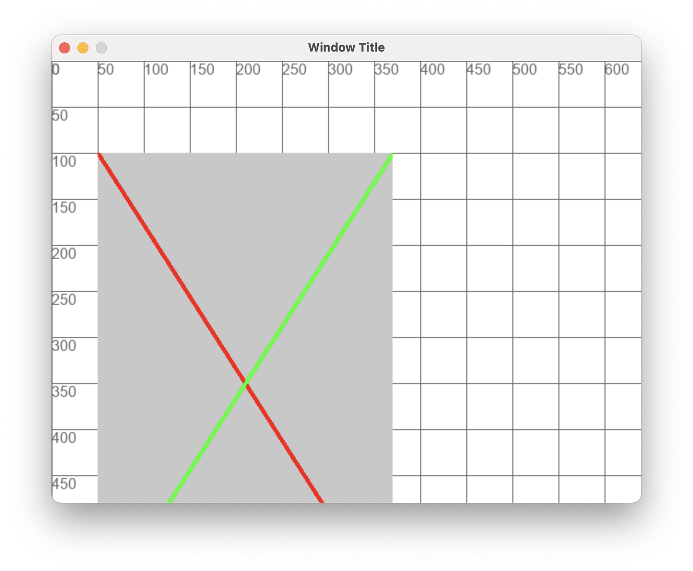
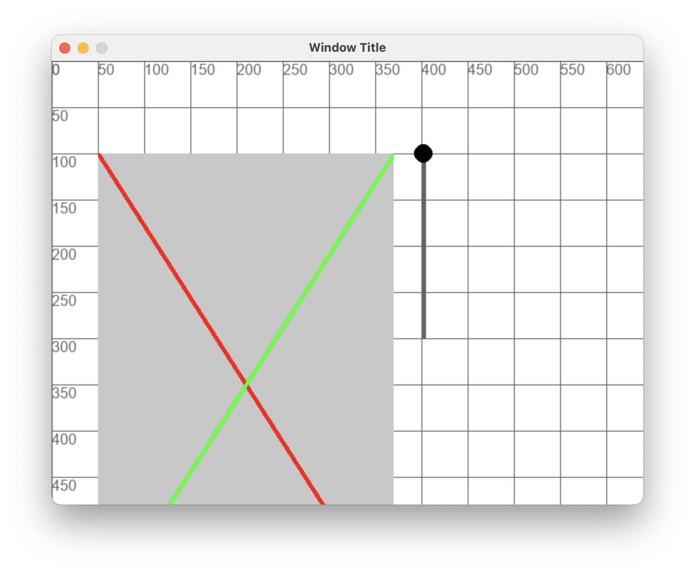

# Entrenament Paint

Farem una eina per fer un efecte de *scrollbar* amb **pygame**

## Exercici 0

Fes un programa **exercici_scroll.py** que:

- Crea una superfície de dibuix 320x500
- Emplena la amb un fons gris
- Dibuixa una creu de diagonal a diagonal (dues linies Vermella i Verda)
- Dibuixa la superfície a la posició 50x100

<br/>
<center>
<br/></center>
<br/>
<br/>

## Exercici 1

Fent servir aquest diccionari:
```python

scroll = {
    "percentage": 0,
    "dragging": False,
    "x": 400,
    "y": 100,
    "width": 5,
    "height": 200,
    "radius": 10,
    "surface_offset": 0,
    "visible_height": 200
}
```

Dibuixa un slider com el de la imatge

<br/>
<center>
<br/></center>
<br/>
<br/>

## Exercici 2

Fes que l'slider anterior sigui arrosegable:

- S'arrossega dins els limits verticals
- Si el mouse sur de l'espai es continua arrossegant
- Es deixa d'arrossegar quan el s'aixeca el botó del mouse

<center>
<video width="100%" controls allowfullscreen style="max-width: 90%; width: 400px; max-height: 250px">
  <source src="./assets/exercici_scroll02.mov" type="video/mp4">
</video>
</center>
<br/>

A la funció **app_run** s'ha d'actualitzar:

- scroll["percentage"]
- scroll["dragging"]

## Exercici 3

Fes que es calculi *scroll["surface_offset"]* segons:

- scroll["percentage"]
- surface.get_height()
- scroll["visible_height"]

Fes servir aquesta informació per dibuixar la porció de la superfície que correspon a la posició de l'scroll amb mida màxima *scroll["height"]*

<center>
<video width="100%" controls allowfullscreen style="max-width: 90%; width: 400px; max-height: 250px">
  <source src="./assets/exercici_scroll03.mov" type="video/mp4">
</video>
</center>
<br/>