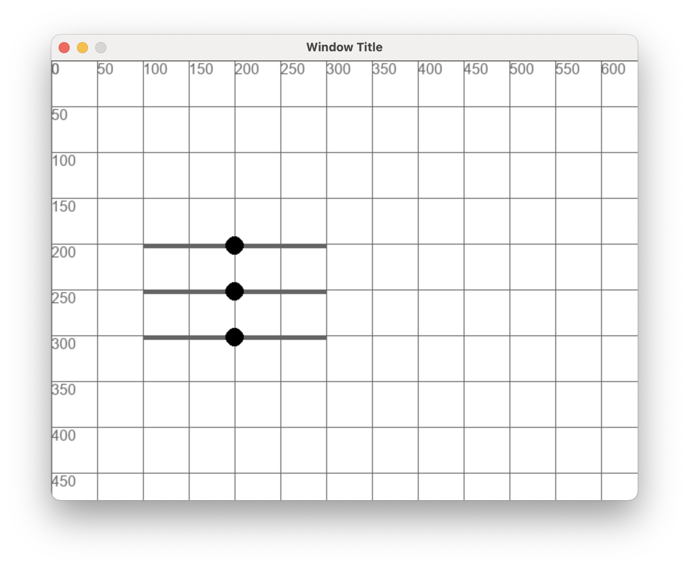
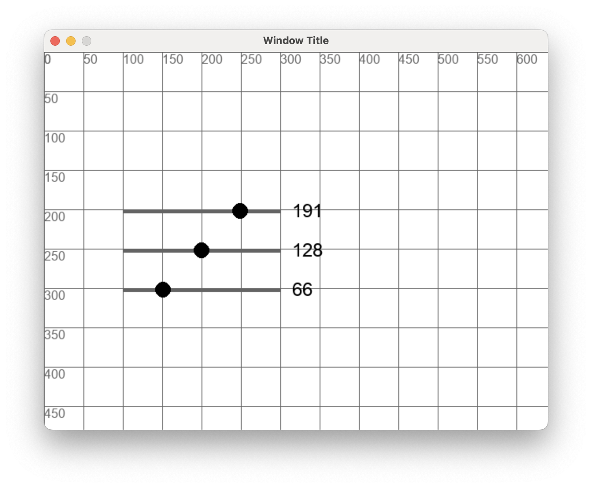

# Entrenament Sliders

Farem una eina per escollir un color RGB amb **pygame**

## Exercici 0

Fes un programa **exercici_sliders** que faci aquest dibuix amb un bucle i la funció **"draw_slider(slider)"**:

<br/>
<center>
<br/></center>
<br/>
<br/>

Es tracta de sliders per escollir valors entre 0 i 255 i que han d'estar definits al codi així:
```python
sliders = [
    { "value": 128, "x": 100, "y": 200, "width": 200, "height": 5, "dragging": False, "radius": 10 },
    { "value": 128, "x": 100, "y": 250, "width": 200, "height": 5, "dragging": False, "radius": 10 },
    { "value": 128, "x": 100, "y": 300, "width": 200, "height": 5, "dragging": False, "radius": 10 }
]
```
De moment "dragging" no fa res, serà per detectar l'arrosegament.

El radi del cercle ha de ser 10.

La posició "x" del cercle ha de ser proporcional al valor, tenint en compte que els limits són entre 0 i 255. 

Per tant, 128 és la meitat

## Exercici 1

Fent servir aquest objecte:
```python
mouse = { 
    "x": -1, 
    "y": -1,
    "pressed": False
}
```
Actualitza els valors des de la funció **"app_events"**

## Exercici 2

Implementa l'arrossegament dels cercles a la funció **"app_run"**:

- L'arrosegament comença quan es fa **mouse down** dins d'algun cercle
- L'arrosegament es manté mentre no es fa **mouse up** encara que es surti del cercle
- Només es pot arrosegar un cercle al mateix temps

## Exercici 3

Fes la funció "draw_value(slider)" que dibuixa el valor numèric escollit al costat de l'slider.

Si no ho has implementat, fer que "app_run" actualitzi "value" a partir de la posició on s'ha arrossegat el cercle.

<br/>
<center>
<br/></center>
<br/>
<br/>

## Exercici 4

Fes que es dibuixi un requadre amb el valor RGB sel·leccionat pels sliders.

<center>
<video width="100%" controls allowfullscreen style="max-width: 90%; width: 400px; max-height: 250px">
  <source src="./assets/exercici_sliders02.mov" type="video/mp4">
</video>
</center>
<br/>