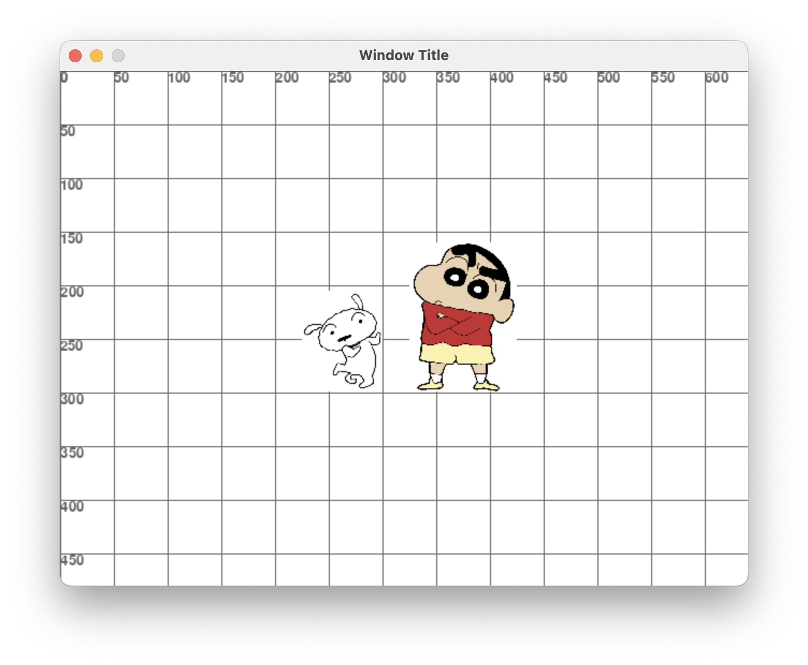
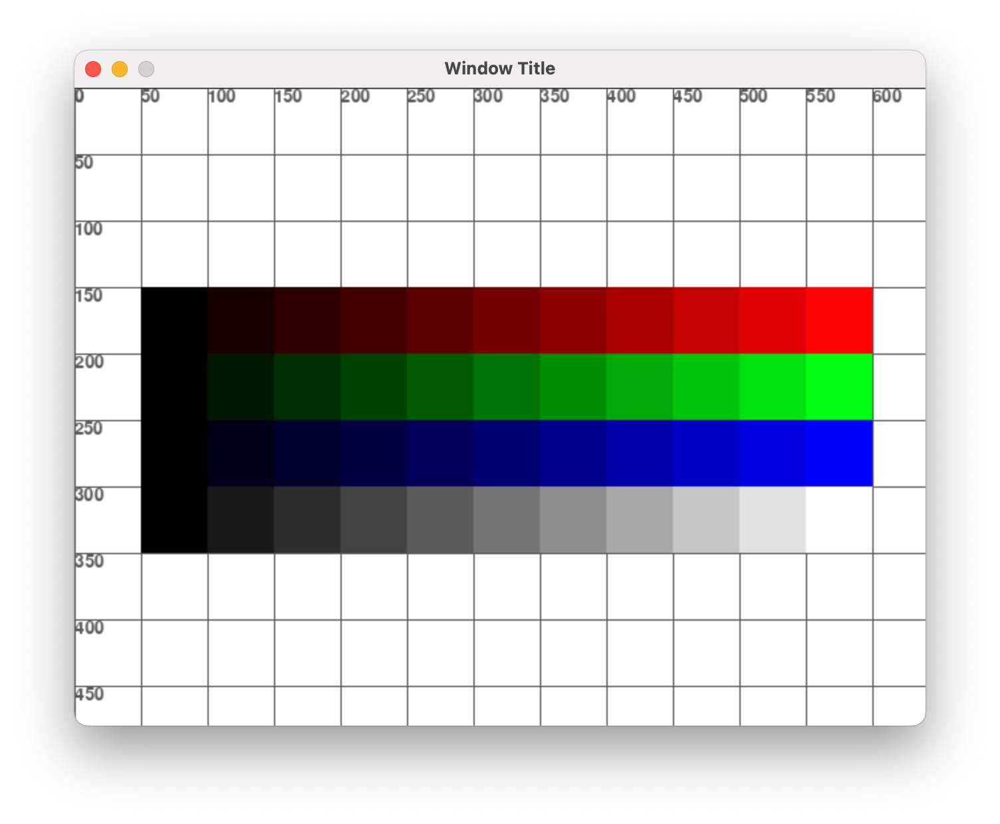
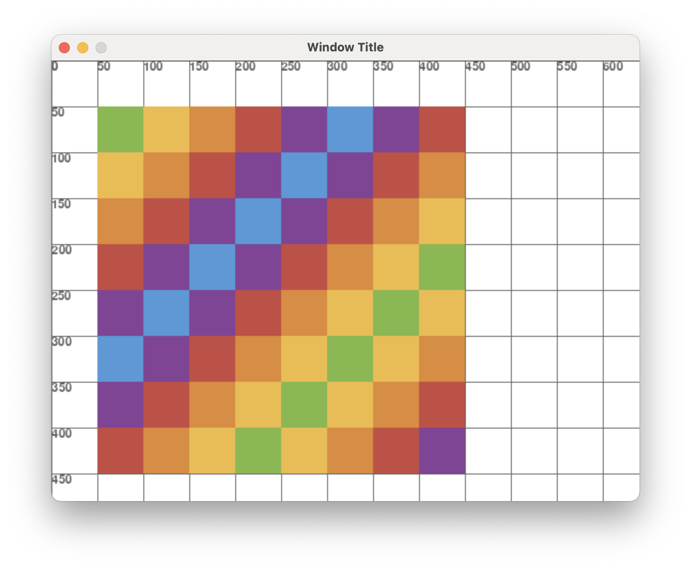
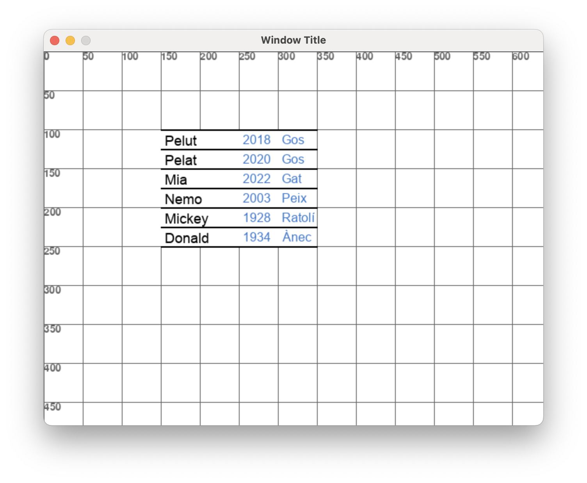
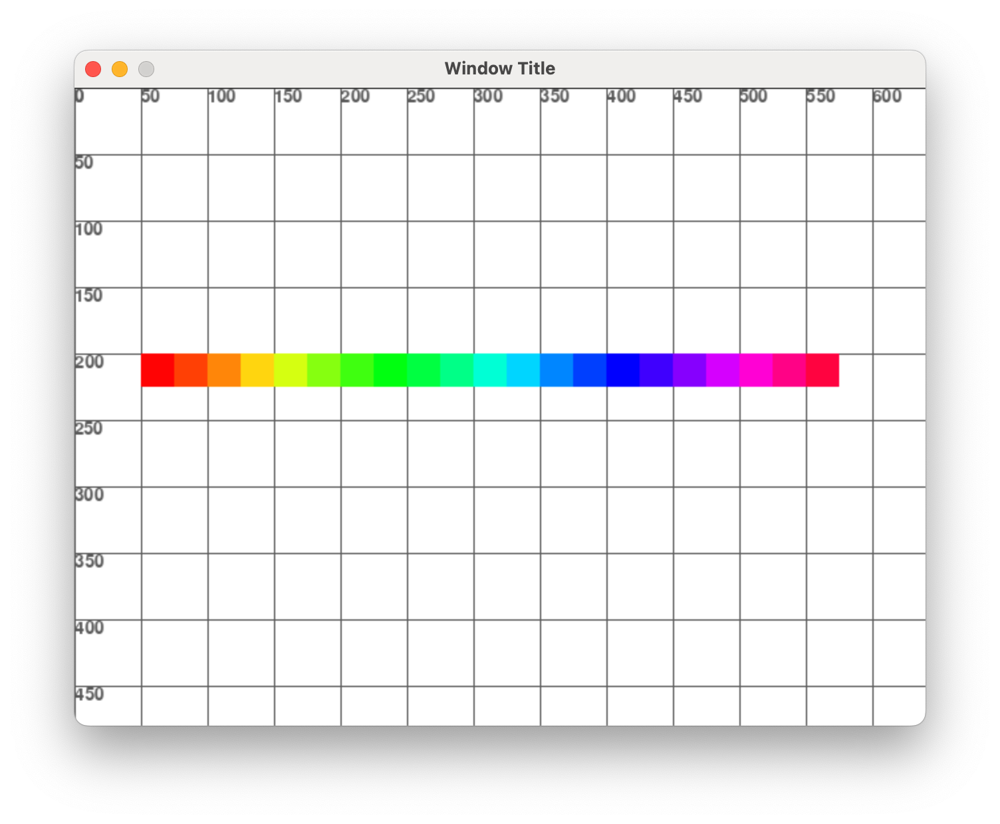
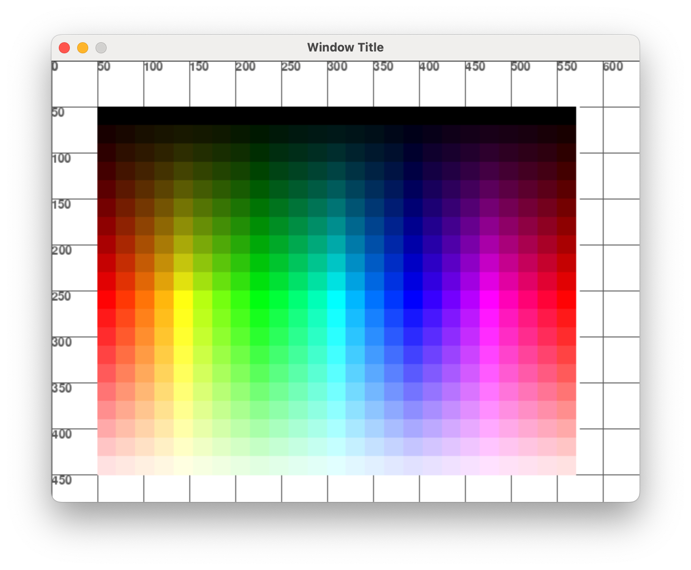

# Exercicis dibuix

Resol aquests exercicis, entrega la URL del projecte GitHub amb els exercicis resolts.

## Exercici 0

Fes un programa **exercici000.py** que faci el següent dibuix, amb les eines de dibuix de **pygame**.

<br/>
<center>
<br/></center>
<br/>

## Exercici 1

Fes un programa **exercici001.py** que faci el següent dibuix, amb les eines de dibuix de **pygame**.

Les tipografies són:

- Arial de mida 60
- Courier New de mida 40, Bold
- Arial de 28
- El color verd és: (100, 150, 100)

<br/>
<center>
<br/></center>
<br/>

## Exercici 2

Fes un programa **exercici002.py** que faci el següent dibuix, amb les eines de dibuix de **pygame**.

Els arxius estàn a: *"./assets/exercici002/"*

Fes servir aquesta funció d'escalat, amb un ample de 100 per en Shinnosuke i de 75 per en Shiro.

```python
def scale_image(im_shinnosuke, target_width=None, target_height=None):

    original_width, original_height = im_shinnosuke.get_size()
    aspect_ratio = original_height / original_width

    if target_width and not target_height:  # Escalar per ample mantenint la proporció
        new_width = target_width
        new_height = int(target_width * aspect_ratio)
    elif target_height and not target_width:  # Escalar per altura mantenint la proporció
        new_height = target_height
        new_width = int(target_height / aspect_ratio)
    elif target_width and target_height:  # Escalar deformant la imatge
        new_width = target_width
        new_height = target_height
    else:
        raise ValueError("Especifica almenys un dels dos paràmetres: target_width o target_height.")

    scaled_im_shinnosuke = pygame.transform.scale(im_shinnosuke, (new_width, new_height))
    return scaled_im_shinnosuke
```

<br/>
<center>
<br/></center>
<br/>

## Exercici 3

Fes un programa **exercici003.py** que faci el següent dibuix, amb les eines de dibuix de **pygame**.

Fes servir dos bucles:

- Un bucle per els colors emplenats vermells i blancs
- Un bucle pels cercles negres

<br/>
<center>
<br/></center>
<br/>

## Exercici 4

Fes un programa **exercici004.py** que faci el següent dibuix, amb les eines de dibuix de **pygame**.


<br/>
<center>
<br/></center>
<br/>

## Exercici 6

Fes un programa **exercici006.py** que faci el següent dibuix, fent servir bucles anidats:

```python
    for row in range(8):
        for column in range(8):
```

<br/>
<center>
<br/></center>
<br/>

## Exercici 7

Fes un programa **exercici007.py** que faci el següent dibuix, a partir de dos bucles:

- Els bucles es defineixen com **for q in range (0, len(colors))**

- Els colors del primer bucle s'obtenen de la següent llista
    colors = [(127, 184, 68), (240, 187, 64), (226, 137, 50), (202, 73, 65), (135, 65, 152), (75, 154, 217)]

- Els colors *grisos* s'obtenen dinàmicament des de (0, 0, 0) sumant 25 a cada iteració.

- La mida dels quadres és de 50 i els radis de la resta de polígons és de 25

- Necessitaràs la següent funció per dibuixar els triangles i pentàgons.

```pyton
def draw_polygon(screen, color, center, radius, num_vertices, angle_offset=(math.pi / 3)):
    points = [
        (
            center[0] + radius * math.cos(angle_offset + i * 2 * math.pi / num_vertices),
            center[1] + radius * math.sin(angle_offset + i * 2 * math.pi / num_vertices)
        )
        for i in range(num_vertices)
    ]
    pygame.draw.polygon(screen, color, points)
```

<br/>
<center>
<br/></center>
<br/>

## Exercici 8

Fes un programa **exercici008.py** que faci el següent dibuix, a partir de la següent matriu, on cada número de la matriu correspon a un color de la llista del primer exercici. 

```text
board = [
    [0, 1, 2, 3, 4, 5, 4, 3],
    [1, 2, 3, 4, 5, 4, 3, 2],
    [2, 3, 4, 5, 4, 3, 2, 1],
    [3, 4, 5, 4, 3, 2, 1, 0],
    [4, 5, 4, 3, 2, 1, 0, 1],
    [5, 4, 3, 2, 1, 0, 1, 2],
    [4, 3, 2, 1, 0, 1, 2, 3],
    [3, 2, 1, 0, 1, 2, 3, 4],
]
```

<br/>
<center>
<br/></center>
<br/>

## Exercici 9

Fes un programa **exercici009.py** que faci el següent dibuix, a partir de la següent llista de dades.

- Fes un fons blanc per la taula d'informació
- Dibuixa les linies horitzontals de cada fila en un bucle
- La tipografia és "Arial" però pel nom és 18 i els detalls 16
- El color blau es correspon a (50, 120, 200)
- Els textos estàn desplacats 5 pixels horitzontals i 2 verticals

```text
dades = [ 
  {'nom': 'Pelut', 'any': 2018, 'pes': 6.5, 'especie': 'Gos'},
  {'nom': 'Pelat', 'any': 2020, 'pes': 5.0, 'especie': 'Gos'},
  {'nom': 'Mia', 'any': 2022, 'pes': 3.0, 'especie': 'Gat'},
  {'nom': 'Nemo', 'any': 2003, 'pes': 0.1, 'especie': 'Peix'},
  {'nom': 'Mickey', 'any': 1928, 'pes': 0.5, 'especie': 'Ratolí'},
  {'nom': 'Donald', 'any': 1934, 'pes': 0.5, 'especie': 'Ànec'} ]
```

<br/>
<center>
<br/></center>
<br/>

## Exercici 14

Fes un programa **exercici014.py** que faci el següent dibuix, a partir del bucle:

```python
for counter in range(0, 11):
```

El valor de lluminositat de cada color es calcula a partir del propi comptador i del limit de 255 valors que té cada color RGB:

```python
light = counter * (255 / 10)
```

La posició **x** de cada quadre també s'ha de calcular a partir de **counter**

<br/>
<center>
<br/></center>
<br/>

## Exercici 15

Fes un programa **exercici015.py** que faci el següent dibuix, a partir d'un bucle i la funció que transforma valors de color HSL a RGB:

```python
def hsl_to_rgb(hue, saturation, lightness):
    hue = hue / 360
    a = saturation * min(lightness, 1 - lightness)

    k_r = (0 + hue * 12) % 12
    k_g = (8 + hue * 12) % 12
    k_b = (4 + hue * 12) % 12

    r = int(255 * (lightness - a * max(-1, min(k_r - 3, 9 - k_r, 1))))
    g = int(255 * (lightness - a * max(-1, min(k_g - 3, 9 - k_g, 1))))
    b = int(255 * (lightness - a * max(-1, min(k_b - 3, 9 - k_b, 1))))

    return r, g, b
```

Els color [HSL](https://en.wikipedia.org/wiki/HSL_and_HSV) representen els colors a partir de:

- **hue**: Un número entre 0 i 360 que representa el color (to) en el cercle cromàtic. 
- **saturation**: Un número entre 0 i 1 que representa la saturació o intensitat del color. 
- **lightness**: Un número entre 0 i 1 que representa la lluminositat del color. 

Per fer l'exercici fes servir:

- El bucle: **for hue in range(0, 361, 15):**
- **x**: 50 + hue * (500 / 360)
- **saturation**: 1.0
- **lightness**: 0.5
- Cada quadre és de 21x21

<br/>
<center>
<br/></center>
<br/>

## Exercici 16

Fes un programa **exercici016.py** que faci el següent dibuix, a partir de dos bucles anidats:

```python
for hue in range(0, 361, 15):
    for counter in range(0, 100, 5):
```

- Obté un valor entre 0 i 1 equivalent al counter (dividir per 100)
- **y**: 50 + counter * 4
- **saturation**: 1.0
- **lightness**: Igual al valor entre 0 i 1 del càlcul anterior
- Cada quadre és de 21x21

<br/>
<center>
<br/></center>
<br/>

## Exercici 17

Fes un programa **exercici017.py** que faci el següent dibuix, a partir d'un bucle així:

```python
for angle in range(0, 361, 15):
```

Fes servir la funció següent per obtenir la posició dels punts (x, y) a partir de l'angle anterior:

```python
def posicio_perimetre_cercle(center, radi, angle_graus):
    angle_radians = math.radians(angle_graus)  # Convertir l'angle a radians
    x = center[0] + radi * math.cos(angle_radians)    # Coordenada X
    y = center[1] + radi * math.sin(angle_radians)    # Coordenada Y
    return x, y
```

La mida de gruix de les línies és de 5.

<br/>
<center>
<br/></center>
<br/>

## Exercici 18

Fes un programa **exercici018.py** que faci el següent dibuix, una [roda de colors](https://en.wikipedia.org/wiki/Color_wheel) a partir de valors HSL i dibuix amb **pygame.draw.polygon**

Per fer-ho, calcula les linies com a l'exercici anterior i defineix un polígon entre la línia actual i la linia anterior. 

Després emplena aquest polígon del color HSL amb l'**angle** que correson, **saturarion** a 1.0 i **lightness** a 0.5.

<br/>
<center>
<br/></center>
<br/>

## Exercici 19

Fes un programa **exercici019.py** que faci el següent dibuix, fent servir la funció **"draw_moves"** a l'estil [Sketch](https://en.wikipedia.org/wiki/Etch_A_Sketch).

```python
def draw_moves(color, start_pos, moves):
    # Dibuixa un poligon segons les instruccions rebudes a la llista 'moves'
    # Les instruccions són una direcció (up, down, left, right) i una distància
```

Així, la funció **"draw"** farà aquetes crides a **"draw_moves"**:

```python
draw_moves(BROWN, (350, 400), moves_house)
draw_moves(YELLOW, (50, 100), moves_sun)
draw_moves(BLUE, (100, 400), moves_car)
draw_moves(GREEN, (0, 400), moves_grass)
```

Els moviments són:

```python
moves_house = [{"direction": "right", "distance": 250}, {"direction": "up", "distance": 200}, {"direction": "left", "distance": 50}, {"direction": "up", "distance": 50}, {"direction": "left", "distance": 50}, {"direction": "up", "distance": 50}, {"direction": "left", "distance": 50}, {"direction": "down", "distance": 50}, {"direction": "left", "distance": 50}, {"direction": "down", "distance": 50}, {"direction": "left", "distance": 50}, {"direction": "down", "distance": 200}]
moves_sun = [{"direction": "right", "distance": 25}, {"direction": "up", "distance": 25}, {"direction": "right", "distance": 25}, {"direction": "up", "distance": 25}, {"direction": "right", "distance": 50}, {"direction": "down", "distance": 25}, {"direction": "right", "distance": 25}, {"direction": "down", "distance": 25}, {"direction": "right", "distance": 25}, {"direction": "down", "distance": 50}, {"direction": "left", "distance": 25}, {"direction": "down", "distance": 25}, {"direction": "left", "distance": 25}, {"direction": "down", "distance": 25}, {"direction": "left", "distance": 50}, {"direction": "up", "distance": 25}, {"direction": "left", "distance": 25}, {"direction": "up", "distance": 25}, {"direction": "left", "distance": 25} ]
moves_car = [{"direction": "up", "distance": 50}, {"direction": "right", "distance": 50}, {"direction": "up", "distance": 50}, {"direction": "right", "distance": 50}, {"direction": "down", "distance": 50}, {"direction": "right", "distance": 50}, {"direction": "down", "distance": 50} ]
moves_grass = [{"direction": "right", "distance": 650}, {"direction": "down", "distance": 100}, {"direction": "left", "distance": 650}]
```

<br/>
<center>
<br/></center>
<br/>

## Exercici 20

Fes un programa **exercici020.py** que a partir d'un diccionari **board** tipus:

```python
board = {
    "position": { 
        "x": 50, 
        "y": 50 
    },
    "size": { 
        "rows": 15, 
        "cols": 10 
    },
    "cell_size": 25
}
```

Defineix les següents funcions:

- **"def draw_board(board)"**: dibuixa el taulell segons els paràmetres configurats a **board**

- **"def cell_from_point(point, board)"**: Retorna la **fila** i **columna** d'una cel·la del taulell, segons la posició **point**

- **"def point_from_cell(cell, board)"**: Retorna la posició **x** i **y** d'una cel·la que té els paràmetres **row** i **column**

A més, quan el mouse passa pel damunt d'alguna cel·la aquesta s'ha de dibuixar de color *BLUE (50, 120, 200)*.

<center>
<video width="100%" controls allowfullscreen style="max-width: 90%; width: 400px; max-height: 250px">
  <source src="./assets/exercici020.mov" type="video/mp4">
</video>
</center>
<br/>

## Exercici 21

Fes un programa **exercici021.py** que generi una graella de números aleatòris entre el 0 i el 9, la graella ha de ser de 10 files i 15 columnes. Aleshores

- Dibuixa la graella on cada cel·la faci 25x25
- Quan el mouse es posa per damunt d'una cel·la canvia el color de fons de totes les cel·les que tenen el mateix número que aquella cel·la
- Quan es fa click en una cel·la, s'esborren totes les cel·les que tenen el mateix número que aquella cel·la

Hauràs de definir les funcions:
```python
def get_cell_value(cell) # Retorna el valor d'una cel·la
def draw_board_values() # Dibuixa els valors del taulell
```

**Nota:** Podeu fer servir les funcions de l'exercici 10 *(draw_board, cell_from_point_, point_from_cell)

<center>
<video width="100%" controls allowfullscreen style="max-width: 90%; width: 400px; max-height: 250px">
  <source src="./assets/exercici021.mov" type="video/mp4">
</video>
</center>
<br/>

## Exercici 22

Fes un programa **exercici022.py** que canvii la mida d'unes caselles segons la distància del mouse fins a les caselles.

A la funció **app_run** caldrà fer dos bucles:

- El primer bucle mira si el mouse està dins d'alguna casella, tenint en compte la mida
- El segon bucle, si el mouse no està dins de cap cassella, assigna a totes una mida de 5
- El segon bucle, si el mouse està dins d'alguna cassela, calcula la distància horitzontal fins a la casella i assigna una alçada així

```python
distance = abs(cell_x - mouse_pos["x"])

max_distance = 200  # Distància màxima per al mínim efecte
heights[cnt] = max(5, 45 - min(distance, max_distance) * (40 / max_distance))
```

<center>
<video width="100%" controls allowfullscreen style="max-width: 90%; width: 400px; max-height: 250px">
  <source src="./assets/exercici022.mov" type="video/mp4">
</video>
</center>
<br/>

## Exercici 23

Fes un programa **exercici023.py** que faci una simulació del sistema solar. Per fer-ho:

```python
# Colors
WHITE = (255, 255, 255)
BLACK = (0, 0, 0)
BLUE = (50, 120, 200)
BROWN = (165, 42, 42)
YELLOW = (255, 255, 0)
GRAY = (200, 200, 200)
ORANGE = (255, 165, 0)
GOLD = (255, 215, 0)
LIGHT_GRAY = (169, 169, 169) 
RED = (255, 69, 0) 

# Dades del sistema
earth_rotation = 150
sun = {
    "pos": (0, 0),
    "radius": earth_rotation / 10
}
planets = {
    "Mercury": { "angle": 0, "distance": 0.39, "speed": 47.87, "size": 0.38, "color": LIGHT_GRAY, "pos": (0, 0) },
    "Venus":   { "angle": 0, "distance": 0.72, "speed": 35.02, "size": 0.95, "color": GOLD, "pos": (0, 0) },
    "Earth":   { "angle": 0, "distance": 1.00, "speed": 29.78, "size": 1.00, "color": BLUE, "pos": (0, 0) },
    "Mars":    { "angle": 0, "distance": 1.52, "speed": 24.07, "size": 0.53, "color": RED, "pos": (0, 0) },
}

# A "app_run" es calcularà l'angle i la posició segons l'animació

# A "app_run" posiciona el sol al centre de la pantalla
sun["pos"] = (screen.get_width() // 2, screen.get_height() // 2) 

# A "app_run" calcula la posició de cada planeta amb la funció
def posicio_perimetre_cercle(center, radi, angle_graus):
    angle_radians = math.radians(angle_graus)  # Convertir l'angle a radians
    x = center[0] + radi * math.cos(angle_radians)    # Coordenada X
    y = center[1] + radi * math.sin(angle_radians)    # Coordenada Y
    return x, y

# A "app_draw" tingues en compte que el plantea es dibuixa amb una mida 
planet_draw_radius = int(planet["size"] * 10)

# A "app_draw" tingues en compte que els noms dels planetes s'alinean a la dreta + 5
label = font.render(name, True, LIGHT_GRAY)
label_rect = label.get_rect()
label_rect.midleft = (planet["pos"][0] + planet_draw_radius + 5, planet["pos"][1]) 
screen.blit(label, label_rect)
```

<center>
<video width="100%" controls allowfullscreen style="max-width: 90%; width: 400px; max-height: 250px">
  <source src="./assets/exercici023.mov" type="video/mp4">
</video>
</center>
<br/>