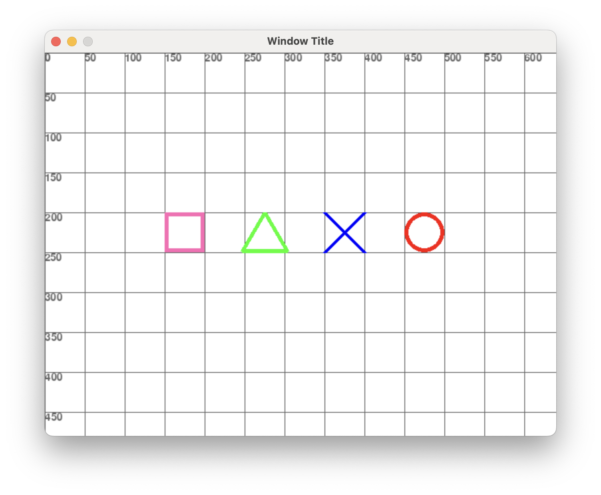
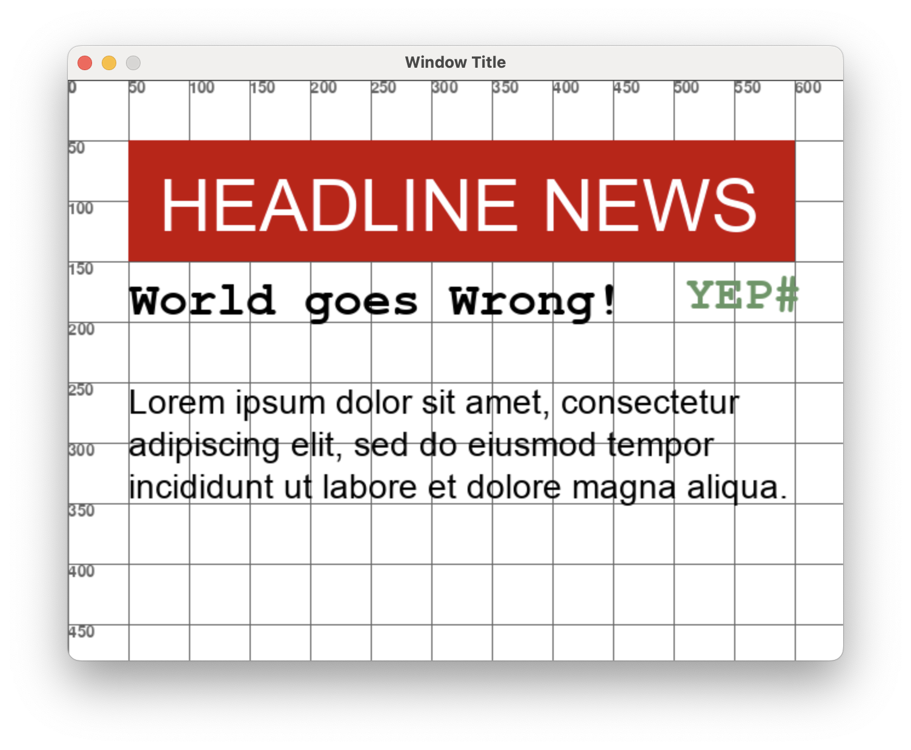
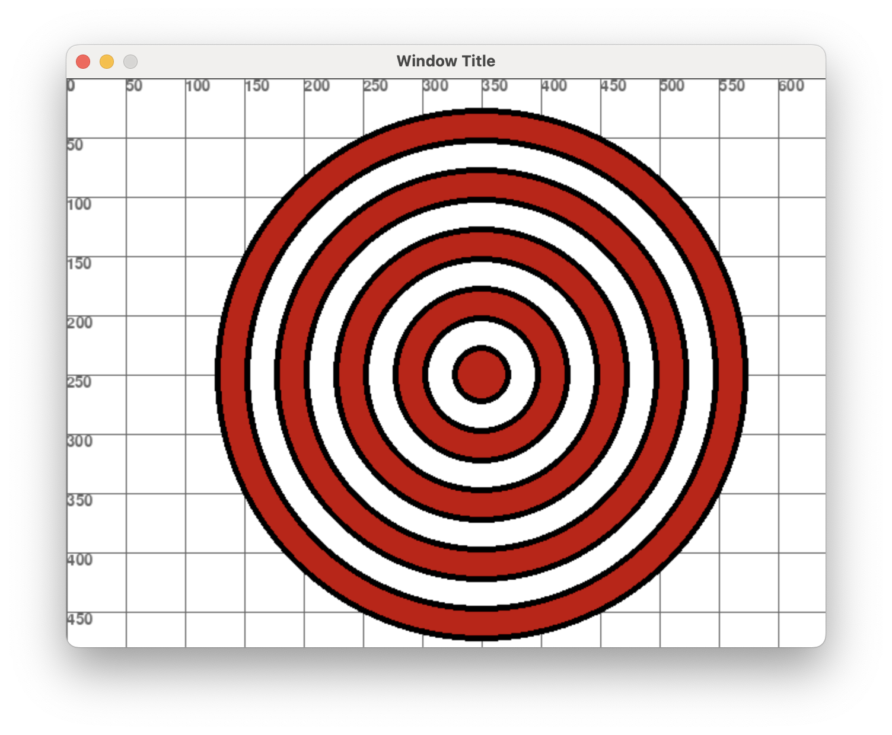
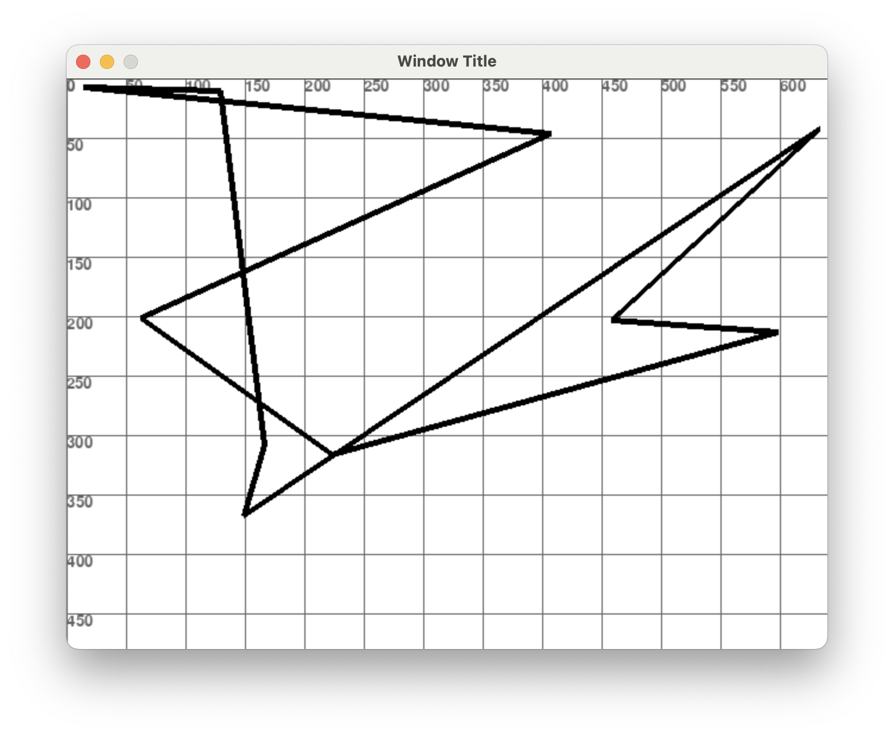
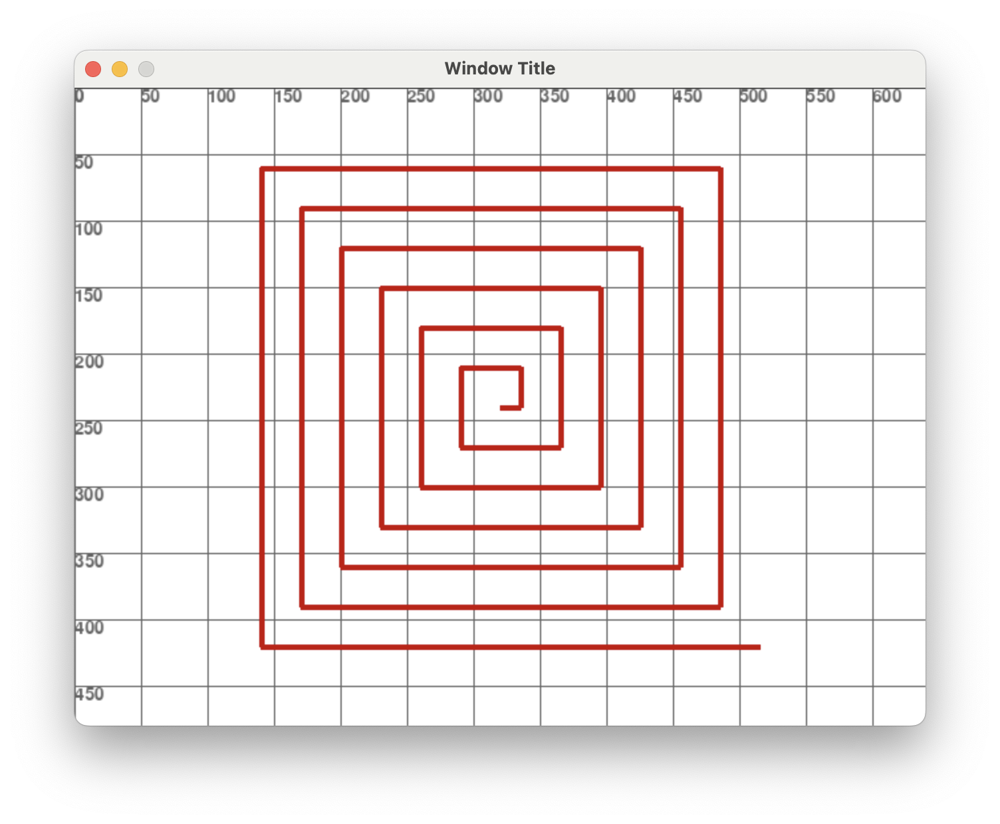
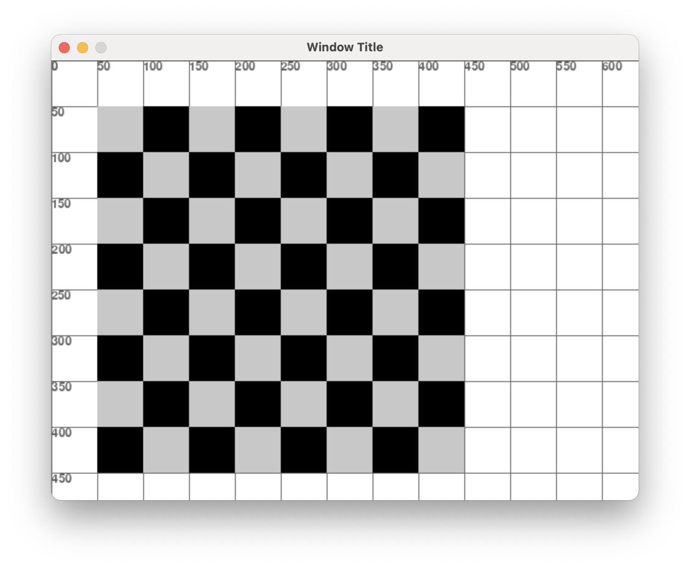
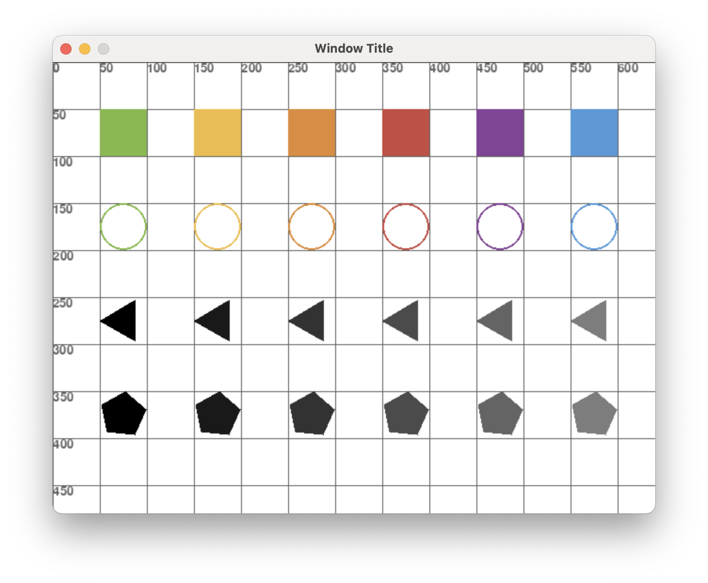
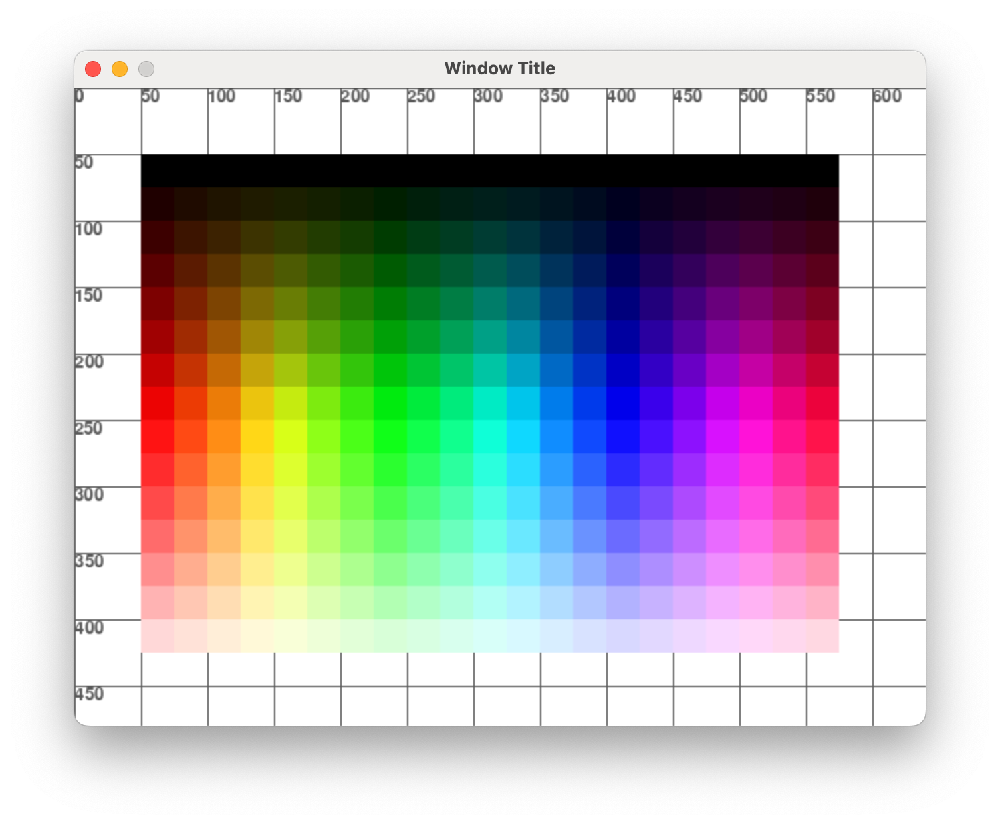
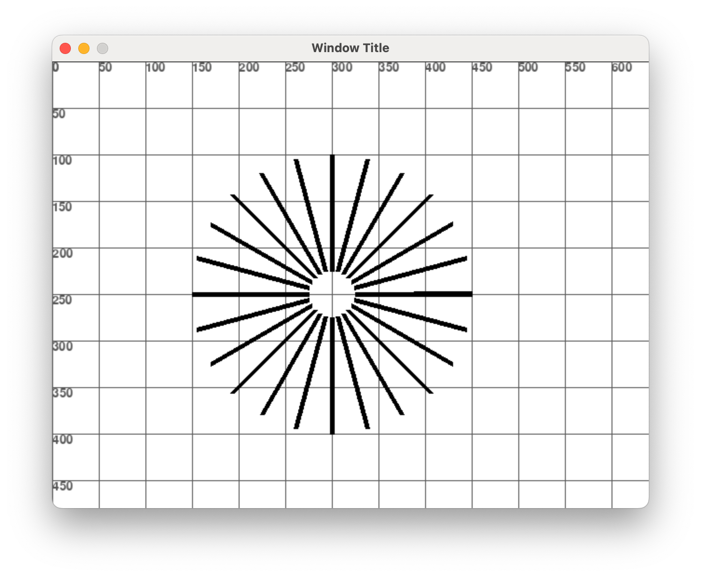
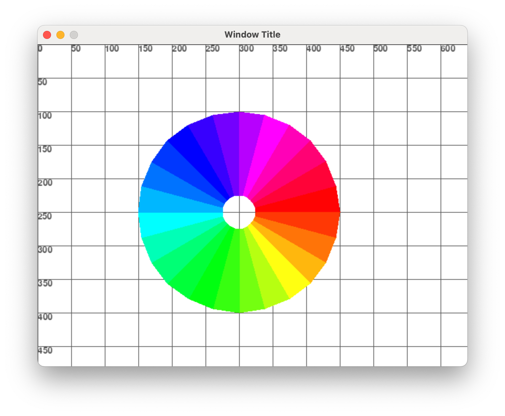

# Exercicis dibuix

Resol aquests exercicis, entrega la URL del projecte GitHub amb els exercicis resolts.

## Exercici 0

Fes un programa **exercici000.py** que faci el següent dibuix, amb les eines de dibuix de **pygame**.

<br/>
<center>
<br/></center>
<br/>

## Exercici 1

Fes un programa **exercici001.py** que faci el següent dibuix, amb les eines de dibuix de **pygame**.

Les tipografies són:

- Arial de mida 60
- Courier New de mida 40, Bold
- Arial de 28
- El color verd és: (100, 150, 100)

<br/>
<center>
<br/></center>
<br/>

## Exercici 2

Fes un programa **exercici002.py** que faci el següent dibuix, amb les eines de dibuix de **pygame**.

Els arxius estàn a: *"./assets/exercici002/"*

Fes servir la funció d'escalat que hi ha a utils, amb un ample de 100 per en Shinnosuke i de 75 per en Shiro.

```python
# Carregar la imatge d'en Shinnosuke
path_shinnosuke = os.path.join(os.path.dirname(__file__), "./assets/exercici002/shinnosuke.png")
im_shinnosuke = pygame.image.load(path_shinnosuke).convert_alpha()
im_shinnosuke = utils.scale_image(pygame, im_shinnosuke, target_width=100)
```

<br/>
<center>
<br/></center>
<br/>

## Exercici 3

Fes un programa **exercici003.py** que faci el següent dibuix, amb les eines de dibuix de **pygame**.

Fes servir dos bucles:

- Un bucle pels colors emplenats vermells i blancs
- Un bucle pels cercles negres

<br/>
<center>
<br/></center>
<br/>

## Exercici 4

Fes un programa **exercici004.py** que faci un dibuix aleatori, amb les eines de dibuix de **pygame**.

Al iniciar el mètode main, s'ha d'emplenar una llista amb 10 coordenades (x,y) aleatòria dins dels limits de la finestra.

```python
window_width, window_height = screen.get_size()
```

Aleshores la funció draw ha de dibuixar la llista anterior, com a **polygon**

<br/>
<center>
<br/></center>
<br/>

## Exercici 5

Fes un programa **exercici005.py** que faci el següent dibuix, amb les eines de dibuix de **pygame**.

S'ha de dibuixar una espiral rectangular que surt des del centre de la finestra:
```python
# Centre de la pantalla
center_x, center_y = int(screen.get_width() / 2), int(screen.get_height() / 2)
```

En total ha de fer 25 voltes (linies) a partir d'un bucle:
```python
for _ in range(25)
```

A cada volta (linia), s'incrementa en 15 pixels el dibuix de la següent linia

<br/>
<center>
<br/></center>
<br/>

## Exercici 6

Fes un programa **exercici006.py** que faci el següent dibuix, fent servir bucles anidats:

```python
    for row in range(8):
        for column in range(8):
```

<br/>
<center>
<br/></center>
<br/>

## Exercici 7

Fes un programa **exercici007.py** que faci el següent dibuix, a partir de dos bucles:

- Els bucles es defineixen com: **"for q in range (0, len(colors))"**

- Els colors del primer bucle s'obtenen de la següent llista:
    **"colors = [(127, 184, 68), (240, 187, 64), (226, 137, 50), (202, 73, 65), (135, 65, 152), (75, 154, 217)]"**

- Els colors *grisos* s'obtenen dinàmicament des de (0, 0, 0) sumant 25 a cada iteració. És a dir: **"(0, 0, 0) > (25, 25, 25) > (50, 50, 50) ..."**

- La mida dels quadres és de **50** i els radis de la resta de polígons és de **25**

- Necessitaràs la següent funció per dibuixar els triangles i pentàgons.

```python
def draw_polygon(screen, color, center, radius, num_vertices, angle_offset=(math.pi / 3)):
    points = [
        (
            center[0] + radius * math.cos(angle_offset + i * 2 * math.pi / num_vertices),
            center[1] + radius * math.sin(angle_offset + i * 2 * math.pi / num_vertices)
        )
        for i in range(num_vertices)
    ]
    pygame.draw.polygon(screen, color, points)
```

<br/>
<center>
<br/></center>
<br/>

## Exercici 8

Fes un programa **exercici008.py** que faci el següent dibuix, a partir de la següent matriu, on cada número de la matriu correspon a un color de la llista:

```python
colors = [(127, 184, 68), (240, 187, 64), (226, 137, 50), (202, 73, 65), (135, 65, 152), (75, 154, 217)]
board = [
    [0, 1, 2, 3, 4, 5, 4, 3],
    [1, 2, 3, 4, 5, 4, 3, 2],
    [2, 3, 4, 5, 4, 3, 2, 1],
    [3, 4, 5, 4, 3, 2, 1, 0],
    [4, 5, 4, 3, 2, 1, 0, 1],
    [5, 4, 3, 2, 1, 0, 1, 2],
    [4, 3, 2, 1, 0, 1, 2, 3],
    [3, 2, 1, 0, 1, 2, 3, 4],
]
```

<br/>
<center>
<br/></center>
<br/>

## Exercici 9

Fes un programa **exercici009.py** que faci el següent dibuix, a partir de la següent llista de dades.

- Fes un fons blanc per la taula d'informació
- Dibuixa les linies horitzontals de cada fila en un bucle
- La tipografia és "Arial" però pel nom és 18 i els detalls 16
- El color blau es correspon a (50, 120, 200)
- Els textos estàn desplacats 5 pixels horitzontals i 2 verticals

S'ha de fer amb un bucle, de manera que si hi ha més o menys dades, la taula s'adapta.

```text
dades = [ 
  {'nom': 'Pelut', 'any': 2018, 'pes': 6.5, 'especie': 'Gos'},
  {'nom': 'Pelat', 'any': 2020, 'pes': 5.0, 'especie': 'Gos'},
  {'nom': 'Mia', 'any': 2022, 'pes': 3.0, 'especie': 'Gat'},
  {'nom': 'Nemo', 'any': 2003, 'pes': 0.1, 'especie': 'Peix'},
  {'nom': 'Mickey', 'any': 1928, 'pes': 0.5, 'especie': 'Ratolí'},
  {'nom': 'Donald', 'any': 1934, 'pes': 0.5, 'especie': 'Ànec'} ]
```

<br/>
<center>
<br/></center>
<br/>

## Exercici 10

Fes un programa **exercici010.py** que a partir d'una llista de rectangles i colors:
```python
WHITE = (255, 255, 255)
BLACK = (0, 0, 0)
RED = (255, 0, 0)
GREEN = (0, 255, 0)
BLUE  = (0, 0, 255)
PURPLE = (128, 0, 128)
ORANGE = (255, 165, 0) 
GOLD = (255, 215, 0)
NAVY = (0, 0, 128)
rectangles = [
    { "rect": { "x": 50, "y": 100, "width": 250, "height": 50 }, "color": RED },
    { "rect": { "x": 50, "y": 200, "width": 100, "height": 200 }, "color": GOLD },
    { "rect": { "x": 200, "y": 200, "width": 100, "height": 100 }, "color": BLUE },
    { "rect": { "x": 200, "y": 350, "width": 400, "height": 50 }, "color": PURPLE },
    { "rect": { "x": 350, "y": 100, "width": 50, "height": 200 }, "color": ORANGE },
    { "rect": { "x": 450, "y": 100, "width": 150, "height": 100 }, "color": GREEN },
    { "rect": { "x": 450, "y": 250, "width": 150, "height": 50 }, "color": NAVY }
]
```

Dibuixi els rectangles a les posicions indicades, i els empleni del color quan el mouse passa pel damunt.

Ha de fer servir bucles for, tant a **"app_run""** per detectar si el mouse està en algun rectangle, com a **"app_draw"** per fer el dibuix.

Feu servir la funció **"utils.is_point_in_rect"** per veure si un punt està dins de l'àrea definida per un rectangle:
```python
point= { "x": 15, "y": 15 }
rect = { "x": 10, "y": 10, "width": 20, "height": 20 }
utils.is_point_in_rect(point, rect):
```

<center>
<video width="100%" controls allowfullscreen style="max-width: 90%; width: 400px; max-height: 250px">
  <source src="./assets/exercici010.mov" type="video/mp4">
</video>
</center>
<br/>

## Exercici 11

Fes un programa **exercici011.py** que amb les tecles *"dreta"* i *"esquerra"* del teclat, mogui un cercle per la pantalla.

La mida del cercle ha de canviar segons la posició X on es troba, essent:
```python
size = 10 + (pos_x / 8)
```

La velocitat del moviment és de 100 píxels per segon.

El moviment del cercle ha d'estar limitat a la mida de la finestra:
```python
screen.get_width()
```

<center>
<video width="100%" controls allowfullscreen style="max-width: 90%; width: 400px; max-height: 250px">
  <source src="./assets/exercici011.mov" type="video/mp4">
</video>
</center>
<br/>

## Exercici 12

Fes un programa **exercici012.py** que amb les tecles *"fletxa"* del teclat, es mogui un esquiador per la muntanya.

- L'esquiador pot anar per sobre de la neu
- L'esquiador **no** pot anar fora del taulell 
- L'esquiador **no** pot anar on hi ha un arbre o un ninot de neu.
- L'esquiador sempre comença a la fila 0, columna 0
- El color de fons de cada casella és: **"LIGHT_BLUE = (173, 216, 230)"**
- La mida de cada casella és: **"CELL_SIZE = 50"**

Per carregar les imatges **emoji** necessites importar **svgmoji** que està a la carpeta **"./assets"** així:
```python
from assets.svgmoji.emojis import get_emoji
```

No es poden mostrar **emojis** amb **pygame**, però si imatges de la llibreria **svgmoji** en format **.png**. Pots carregar les imatges així:
```python
img_tree = get_emoji(pygame, "🌲", size=CELL_SIZE)
img_sman = get_emoji(pygame, "☃️", size=CELL_SIZE)
img_snow = get_emoji(pygame, "❄️", size=CELL_SIZE)
img_skater = get_emoji(pygame, "🏂", size=CELL_SIZE)
```

Defineix la funció **"place_random_letters(letter, count)"**:

- Posa "count" vegades la lletra "letter" en posicions aleatòries del tauler
- **No** es poden posar lletres a la posició 0,0

Defineix la funció **"init_board()"**:

- Inicia un tauler de 8 files i 10 columnes amb cadenes de text buides ""
- Inicia 9 caselles amb la lletra "T" fent servir *place_random_letters*
- Inicia 3 caselles amb la lletra "S" fent servir *place_random_letters*
- Inicia 3 caselles amb la lletra "M" fent servir *place_random_letters*

Defineix la funció **"is_skiable_cell(row, col)"**:

- Retorna 'False' si la casella *row/col* està fora del tauler
- Retorna 'False' si la casella *row/col* té un arbre 'T' o un ninot de neu 'M'
- Retorna 'True' si l'esquiador pot anar a aquella casella (està buida o té neu 'S')

La funció **"app_events"** ha de posicionar el jugador a una casella esquiable quan s'apreten les tecles *fletxa*

La funció **"app_draw"** ha de dibuixar el tauler amb caselles de mida 50x50 i imatges:

- On hi ha un arbre **'T'** dibuixa **'img_tree'**
- On hi ha un ninot de neu **'M'** dibuixa **'img_sman'**
- On hi ha neu de neu **'S'** dibuixa **'img_snow'**

També dibuixa el jugador amb **'img_skater'** a la posició on toca

<center>
<video width="100%" controls allowfullscreen style="max-width: 90%; width: 400px; max-height: 250px">
  <source src="./assets/exercici012.mov" type="video/mp4">
</video>
</center>
<br/>

## Exercici 13

Fes un programa **exercici013.py** que amb les tecles *"fletxa"* del teclat, es mogui un cotxe per un circuit.

Les dades inicials del cotxe són:

```python
car = {
    "x": 245,
    "y": 430,
    "angle": 270,
    "speed": 100,
    "img": img_car,
    "direction_x": "none",
    "direction_y": "none",
}
```

Els arxius estàn a: *"./assets/exercici012/"*

El cotxe s'ha de moure en 8 direccions: 

| Direccions | | | |
|--------------|-|-|-|
| | ↖️  | ⬆️ | ↗️  |
| | ⬅️ |    | ➡️  |
| | ↙️  | ⬇️ | ↘️  |

<br/>

Escala el cotxe amb **"target_width=15"** i la imatge amb **"target_height=480"**

Per mostrar el cotxe rotat, fes servir la funció [pygame.transform.rotate](https://www.pygame.org/docs/ref/transform.html#pygame.transform.rotate)
```python
# Dibuixar el cotxe
rotated_img = pygame.transform.rotate(car["img"], car["angle"])
rect = rotated_img.get_rect(center=(car["x"], car["y"]))
screen.blit(rotated_img, rect)
```

<center>
<video width="100%" controls allowfullscreen style="max-width: 90%; width: 500px; max-height: 300px">
  <source src="./assets/exercici013.mov" type="video/mp4">
</video>
</center>
<br/>

## Exercici 14

Fes un programa **exercici014.py** que faci el següent dibuix, a partir del bucle:

```python
for counter in range(0, 11):
```

El valor de lluminositat de cada color es calcula a partir del propi comptador i del limit de 255 valors que té cada color RGB:

```python
light = counter * (255 / 10)
```

La posició **x** de cada quadre també s'ha de calcular a partir de **counter**

<br/>
<center>
<br/></center>
<br/>

## Exercici 15

Fes un programa **exercici015.py** que faci el següent dibuix, a partir d'un bucle.

Els colors [HSL](https://en.wikipedia.org/wiki/HSL_and_HSV) representen els colors a partir de:

- **hue**: Un número entre 0 i 360 que representa el color (to) en el cercle cromàtic. 
- **saturation**: Un número entre 0 i 1 que representa la saturació o intensitat del color. 
- **lightness**: Un número entre 0 i 1 que representa la lluminositat del color. 

Aquesta funció transforma un color **HSL** al format **RGB** de **pygame**:

```python
utils.hsl_to_rgb(hue, saturation, lightness)
```

Per fer l'exercici fes servir:

```python
    columns = 21
    for column in range(0, columns):
```

- **x**: x = 50 + column * 25
- **hue**: hue = (360 / 21) * column
- **saturation**: 1.0
- **lightness**: 0.5
- Cada quadre és de 25x25

<br/>
<center>
<br/></center>
<br/>

## Exercici 16

Fes un programa **exercici016.py** que faci el següent dibuix, a partir de dos bucles anidats:

```python
rows = 15
columns = 21
for row in range(0, rows):
    for column in range(0, columns):
```

I fent servir la funció:
```python
utils.hsl_to_rgb(hue, saturation, lightness)
```

- Obté un valor entre 0 i 1 equivalent al counter (dividir per 100)
- **y**: 50 + row * 25
- **saturation**: 1.0
- **lightness**: (1/ 15) * row
- Cada quadre és de 25x25

<br/>
<center>
<br/></center>
<br/>

## Exercici 17

Fes un programa **exercici017.py** que faci el següent dibuix, a partir d'un bucle així:

```python
for angle in range(0, 361, 15):
```

Fes servir la funció **"utils.point_on_circle"** per obtenir la posició dels punts (x, y) al perímetre del cercle, a partir de l'angle anterior.

La mida de gruix de les línies és de 5.

<br/>
<center>
<br/></center>
<br/>

## Exercici 18

Fes un programa **exercici018.py** que faci el següent dibuix, una [roda de colors](https://en.wikipedia.org/wiki/Color_wheel) a partir de valors HSL i dibuix amb **pygame.draw.polygon**

Per fer-ho, calcula les linies com a l'exercici anterior i defineix un polígon entre la línia actual i la linia anterior. 

Després emplena aquest polígon del color **HSL** amb l'**angle** que correson, **saturarion** a 1.0 i **lightness** a 0.5.

<br/>
<center>
<br/></center>
<br/>

## Exercici 19

Fes un programa **exercici019.py** que faci el següent dibuix, fent servir la funció **"draw_moves"** a l'estil [Sketch](https://en.wikipedia.org/wiki/Etch_A_Sketch).

```python
def draw_moves(color, start_pos, moves):
    # Dibuixa un poligon segons les instruccions rebudes a la llista 'moves'
    # Les instruccions són una direcció (up, down, left, right) i una distància
```

Així, la funció **"draw"** farà aquetes crides a **"draw_moves"**:

```python
draw_moves(BROWN, (350, 400), moves_house)
draw_moves(YELLOW, (50, 100), moves_sun)
draw_moves(BLUE, (100, 400), moves_car)
draw_moves(GREEN, (0, 400), moves_grass)
```

Els moviments són:

```python
moves_house = [{"direction": "right", "distance": 250}, {"direction": "up", "distance": 200}, {"direction": "left", "distance": 50}, {"direction": "up", "distance": 50}, {"direction": "left", "distance": 50}, {"direction": "up", "distance": 50}, {"direction": "left", "distance": 50}, {"direction": "down", "distance": 50}, {"direction": "left", "distance": 50}, {"direction": "down", "distance": 50}, {"direction": "left", "distance": 50}, {"direction": "down", "distance": 200}]
moves_sun = [{"direction": "right", "distance": 25}, {"direction": "up", "distance": 25}, {"direction": "right", "distance": 25}, {"direction": "up", "distance": 25}, {"direction": "right", "distance": 50}, {"direction": "down", "distance": 25}, {"direction": "right", "distance": 25}, {"direction": "down", "distance": 25}, {"direction": "right", "distance": 25}, {"direction": "down", "distance": 50}, {"direction": "left", "distance": 25}, {"direction": "down", "distance": 25}, {"direction": "left", "distance": 25}, {"direction": "down", "distance": 25}, {"direction": "left", "distance": 50}, {"direction": "up", "distance": 25}, {"direction": "left", "distance": 25}, {"direction": "up", "distance": 25}, {"direction": "left", "distance": 25} ]
moves_car = [{"direction": "up", "distance": 50}, {"direction": "right", "distance": 50}, {"direction": "up", "distance": 50}, {"direction": "right", "distance": 50}, {"direction": "down", "distance": 50}, {"direction": "right", "distance": 50}, {"direction": "down", "distance": 50} ]
moves_grass = [{"direction": "right", "distance": 650}, {"direction": "down", "distance": 100}, {"direction": "left", "distance": 650}]
```

<br/>
<center>
<br/></center>
<br/>

## Exercici 20

Fes un programa **exercici020.py** que a partir d'un diccionari **board** tipus:

```python
board = {
    "position": { 
        "x": 50, 
        "y": 50 
    },
    "size": { 
        "rows": 15, 
        "cols": 10 
    },
    "cell_size": 25
}
```

Defineix les següents funcions:

- **"def draw_board(board)"**: dibuixa el taulell segons els paràmetres configurats a **board**

- **"def cell_from_point(point, board)"**: Retorna la **fila** i **columna** d'una cel·la del taulell, segons la posició **point**

- **"def point_from_cell(cell, board)"**: Retorna la posició **x** i **y** d'una cel·la que té els paràmetres **row** i **column**

A més, quan el mouse passa pel damunt d'alguna cel·la aquesta s'ha de dibuixar de color *BLUE (50, 120, 200)*.

<center>
<video width="100%" controls allowfullscreen style="max-width: 90%; width: 400px; max-height: 250px">
  <source src="./assets/exercici020.mov" type="video/mp4">
</video>
</center>
<br/>

## Exercici 21

Fes un programa **exercici021.py** que generi una graella de números aleatòris entre el 0 i el 9, la graella ha de ser de 10 files i 15 columnes. Aleshores

- Dibuixa la graella on cada cel·la faci 25x25
- Quan el mouse es posa per damunt d'una cel·la, canvia el color de fons de totes les cel·les que coincideixen amb valor
- Quan es fa click en una cel·la, s'esborren totes les cel·les que coincideixen amb valor

Hauràs de definir les funcions:
```python
def get_cell_value(cell) # Retorna el valor d'una cel·la
def draw_board_values() # Dibuixa els valors del taulell
```

**Nota:** Podeu fer servir les funcions de l'exercici 10 *(draw_board, cell_from_point_, point_from_cell)

<center>
<video width="100%" controls allowfullscreen style="max-width: 90%; width: 400px; max-height: 250px">
  <source src="./assets/exercici021.mov" type="video/mp4">
</video>
</center>
<br/>

## Exercici 22

Fes un programa **exercici022.py** que canvii la mida d'unes caselles segons la distància del mouse fins a les caselles.

A la funció **app_run** caldrà fer dos bucles:

- El primer bucle mira si el mouse està dins d'alguna casella, tenint en compte la mida
- El segon bucle, si el mouse no està dins de cap cassella, assigna a totes una mida de 5
- El segon bucle, si el mouse està dins d'alguna cassela, calcula la distància horitzontal fins a la casella i assigna una alçada així

```python
distance = abs(cell_x - mouse_pos["x"])

max_distance = 200  # Distància màxima per al mínim efecte
heights[cnt] = max(5, 45 - min(distance, max_distance) * (40 / max_distance))
```

<center>
<video width="100%" controls allowfullscreen style="max-width: 90%; width: 400px; max-height: 250px">
  <source src="./assets/exercici022.mov" type="video/mp4">
</video>
</center>
<br/>

## Exercici 23

Fes un programa **exercici023.py** que faci una simulació del sistema solar. Per fer-ho:

```python
# Colors
WHITE = (255, 255, 255)
BLACK = (0, 0, 0)
BLUE = (50, 120, 200)
BROWN = (165, 42, 42)
YELLOW = (255, 255, 0)
GRAY = (169, 169, 169) 
ORANGE = (255, 165, 0)
GOLD = (255, 215, 0)
RED = (255, 69, 0) 

# Dades del sistema
sun = {
    "pos": (0, 0),
    "radius": 20
}
planets = {
    "Mercury": { "distance": 58,  "speed": 47.87, "radius": 3.80, "color": GRAY, "angle": 0, "pos": (0, 0) },
    "Venus":   { "distance": 108, "speed": 35.02, "radius": 9.50, "color": GOLD, "angle": 0, "pos": (0, 0) },
    "Earth":   { "distance": 150, "speed": 29.78, "radius": 10.0, "color": BLUE, "angle": 0, "pos": (0, 0) },
    "Mars":    { "distance": 228, "speed": 24.07, "radius": 5.30, "color": RED,  "angle": 0, "pos": (0, 0) },
}

# A "app_run" es calcularà:

    # La posició del sol al centre de la finestra
    sun["pos"] = (int(screen.get_width() / 2), int(screen.get_height() / 2)) 

    # Per cada planeta, calcula:
    # -El seu 'angle' a partir de "velocitat*delta_time"
    # (cada planeta té la seva pròpia velocitat "speed")

    # - La seva posició 'x,y' al perímetre de la òrbita,
    #   amb la funció 'utils.point_on_circle'
    #   * El radi és la seva distància fins al sol 
    #   * L'angle l'has calculat al pas anterior

# A "app_draw" per cada planeta es dibuixa:

    # El cercle de la òrbita de color "GRAY = (169, 169, 169)" 
    # Cada planeta a la seva posició

    # El nom del planeta
    label = font.render(name, True, GRAY)
    label_rect = label.get_rect()
    label_rect.midleft = (planet["pos"][0] + planet["radius"] + 5, planet["pos"][1]) 
    screen.blit(label, label_rect)
```

<center>
<video width="100%" controls allowfullscreen style="max-width: 90%; width: 400px; max-height: 250px">
  <source src="./assets/exercici023.mov" type="video/mp4">
</video>
</center>
<br/>

## Exercici 24

Fes un programa **exercici024.py** que mostri un rellotge com el del vídeo.

Fes servir la funció **"utils.point_on_circle"** per obtenir la posició dels punts (x, y) dels números, i agulles al voltant dels seus respectius cercles.

Per obtenir la hora amb precissió en **python**, cal importar:
```python
from datetime import datetime
```

Feu servir un objecte global per guardar les dades de la hora actual:
```python
time = { 
    "hours": 0, 
    "minutes": 0, 
    "seconds": 0
}
```

Actualitzeu la informació de la hora a la funció **"app_run"**:
```python
def app_run():
    global time

    now = datetime.now()
    current_time_ms = now.timestamp() * 1000
    
    # Hores amb fracció de minuts (format 12 hores)
    time["hours"] = (current_time_ms / 3600000) % 12

    # Minuts amb fracció de segons    
    time["minutes"] = (current_time_ms / 60000) % 60

    # Segons amb fracció de mil·lisegons
    time["seconds"] = (current_time_ms / 1000) % 60
```

Aquests són els colors:
```python
WHITE = (255, 255, 255)
BLACK = (0, 0, 0)
BLUE = (50, 120, 200)
RED = (255, 69, 0) 
```

Feu el dibuix amb el rellotge centrat a (325, 250).

- Els números van a un radi de 200
- L'agulla de les hores a un radi de (200*0.4)
- L'agulla dels minuts a un radi de (200*0.7)
- L'agulla dels segons a un radi de (200*0.9)
- Els angles tenen un **"offset = -90"**, per ajustar la posició d'angle 0 d'un rellotge amb la 0 de **pygame**

Exemple de com dibuixar les hores:
```python
degrees_per_hour = (360 / 12)
hour_angle = (degrees_per_hour * time["hours"]) + offset
hour = utils.point_on_circle(center, radius * 0.4, hour_angle)
hour_tuple = (hour["x"], hour["y"])
pygame.draw.line(screen, WHITE, center_tuple, hour_tuple, 10)
```

<center>
<video width="100%" controls allowfullscreen style="max-width: 90%; width: 400px; max-height: 250px">
  <source src="./assets/exercici024.mov" type="video/mp4">
</video>
</center>
<br/>
