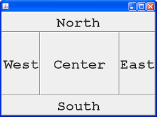
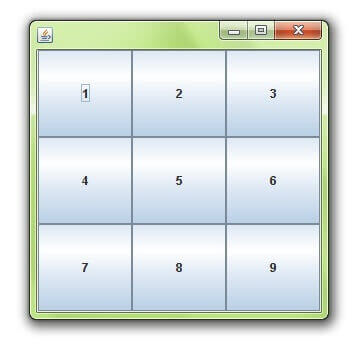
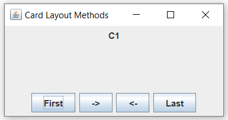
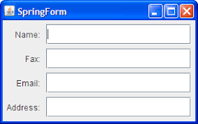
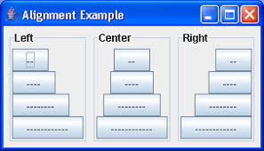
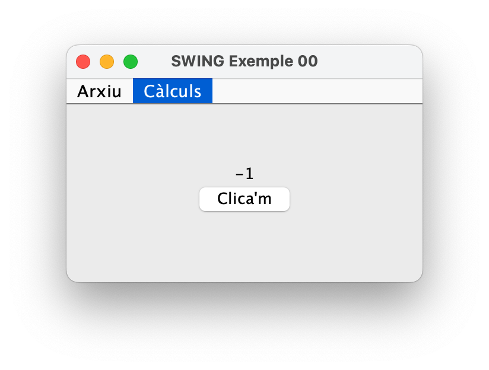
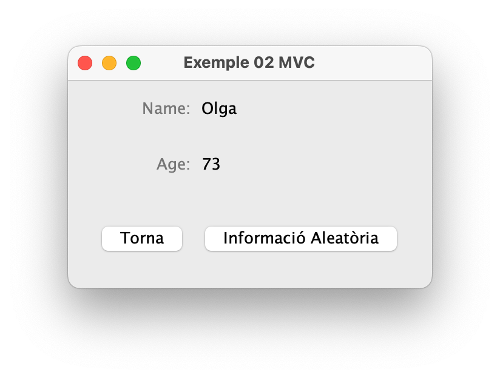
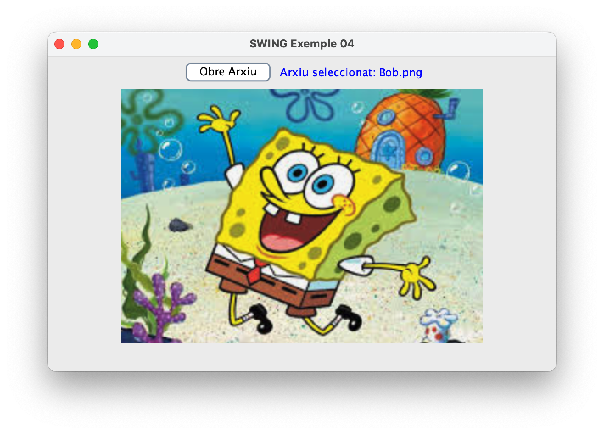

<div style="display: flex; width: 100%;">
    <div style="flex: 1; padding: 0px;">
        <p>© Albert Palacios Jiménez, 2023</p>
    </div>
    <div style="flex: 1; padding: 0px; text-align: right;">
        
    </div>
</div>
<hr/>

# SWING

Swing és la part de les llibreries de JAVA que permet fer interfícies gràfiques d'usuari (GUIs). A més, permet desenvolupar aplicacions per diferents sistemes (Window, Linux i MacOS).

Per fer aplicacions SWING cal importar la llibreria:

```java
import javax.swing.*;
```

Les aplicacions gràfiques en general, tenen múltiples fils d'execució, per reduir els bloquejos de la interfície. En SWING es fa servir **invokeLater** per assegurar que la interfície gràfica s'actualitza correctament:

```java
    public static void main(String[] args) {

        // Inici del fil d'execució de SWING
        SwingUtilities.invokeLater(() -> {
            
            // Mostrar la finestra quan es carrega el programa
            new MainWindow().setVisible(true);
        });
    }
```

## Aplicacions SWING

Les interfícies gràfiques de SWING estàn formades per un arbre de components, on l'arrel principal és la finestra de l'aplicació.

<center></center>

Normalment l'estructura bàsica té els següents components:

- JFrame: finestra principal
- *ContentPane*: Element del JFrame que conté els elements de la finestra
- JMenuBar: Menú de l'aplicació (opcional)

<center></center>

Quan es defineix la finestra amb JFrame, cal indicar el títol que apareix a la barra, la mida de la finestra i opcionalment si el botó de tancar la finestra també tanca l'aplicació:

```java
    // Títol i mida de la finestra
    super("Títol de la Finestra");
    setSize(300, 200);
    setDefaultCloseOperation(JFrame.EXIT_ON_CLOSE);
```


## Action listeners

Els elements interactius permeten fer accions quan l'usuari modifica el seu estat (o valor).

Normalment cal definir una funció a executar quan s'interactua amb l'element, i es fa a través de **addActionListener**.

Els **ActionListener** són una part fonamental de la programació d'interfícies gràfiques d'usuari (GUI) amb Java Swing, permetent respondre a accions de l'usuari, com ara clics de botons, seleccions de menús, ...

Per afegir un ActionListener a un component de Swing que accepti interacció d'usuari, com un botó (JButton), utilitzes el mètode addActionListener del component.

Exemples:

```java
        // Cridar a la funció 'closeApp' quan s'apreta el botó del menú 'Sortir'
        menuItemSortir.addActionListener(e -> closeApp());

        // Cridar a la funció 'modificaComptador' amb paràmetre -1 quan s'apreta el botó 'Restar'
        menuItemRestar.addActionListener(e -> modificaComptador(-1));
```

Tal i com ja s'ha comentat els action listeners simplement criden funcions al executar-se una acció. Hi ha tres maneres de fer aquesta crida:

* Amb una crida directa a una funció amb paràmetres
```java
        menuItemRestar.addActionListener(e -> modificaComptador(-1));
```

* Cridant a una funció de l'objecte (versió més neta a nivell de codi)
```java
        // Crida a la funció 'updateRandomly' (normalment el paràmetre serà l'event)
        randomNumberButton.addActionListener(this::updateRandomly);
```

* Posant el codi que es vol executar dins de la definició de l'acció (versió NO recomanada, deixa el codi molt brut)
```java
        randomNumberButton.addActionListener(e -> {
            // Codi que executa l'acció
            Random random = new Random();
            int value = random.nextInt(99);

            slider.setValue(value);
            updateLabelFromSlider();
        });
```

## Elements del menu

**JMenuBar** és un component opcional que es pot afegir a un JFrame per proporcionar un menú de navegació a l'usuari. Conté un o diversos JMenu:

**JMenu**: Apareix a l'espai horitzontal i desplega un submenú amb diversos ítems.

* JMenuItem: Botó bàsic que executa una acció (funció) al clickar-se
* JCheckBoxMenuItem: Permet activar/desactivar opcions dins del menú
* RadioButtonMenuItem: Forma part d'un grup d'accions exclusives (quan s'activa una es desactiva l'anterior)

Cal definir l'acció que es realitza quan s'interactua amb els elements del menú, es fa a través d'**Action Listeners**

```java
    JMenuBar barraMenu = new JMenuBar();

    // Menú Arxiu
    JMenu menuArxiu = new JMenu("Arxiu");
        JMenuItem menuItemSortir = new JMenuItem("Sortir");
        menuItemSortir.addActionListener(e -> closeApp());
        menuArxiu.add(menuItemSortir);
    barraMenu.add(menuArxiu);

    // Menú per fer Càlculs
    JMenu menuCalculs = new JMenu("Càlculs");
        JMenuItem menuItemSumar = new JMenuItem("Sumar");
        menuItemSumar.addActionListener(e -> modificaComptador(1));
        menuCalculs.add(menuItemSumar);

        JMenuItem menuItemRestar = new JMenuItem("Restar");
        menuItemRestar.addActionListener(e -> modificaComptador(-1));
        menuCalculs.add(menuItemRestar);
    barraMenu.add(menuCalculs);

    this.setJMenuBar(barraMenu);
```

## Layout Managers

Swing ofereix diversos gestors de disposició (Layout Managers) que permeten organitzar els components dins dels contenidors de maneres diferents, segons les necessitats específiques de cada aplicació.

Cada un d'aquests gestors de disposició té les seves pròpies característiques i millors usos. La tria entre ells depèn de les necessitats específiques de la teva interfície d'usuari i com vols que es comportin i es visualitzin els teus components. 

[**BorderLayout**](https://docs.oracle.com/javase/8/docs/api/java/awt/BorderLayout.html): Divideix el contenidor en cinc àrees: Nord (NORTH), Sud (SOUTH), Est (EAST), Oest (WEST), i Centre (CENTER). Cada component afegit al contenidor s'assigna a una d'aquestes àrees. BorderLayout és útil per a disposicions generales on vols que certs components sempre estiguin alineats als marges o al centre.

<center></center>


[**GridLayout**](https://docs.oracle.com/javase/8/docs/api/java/awt/GridLayout.html): Organitza els components en una graella rectangular, on tots els components tenen la mateixa mida. Els components s'omplen de dalt a baix i d'esquerra a dreta, basant-se en el nombre de files i columnes especificades. És útil quan necessites una disposició regular per als teus components, com en una calculadora.

<center></center>


[**GridBagLayout**](https://docs.oracle.com/javase/8/docs/api/java/awt/GridBagLayout.html): És una de les disposicions més flexibles i complexes, permetent als components ocupar múltiples files i columnes de la graella, especificar l'espai entre components, alineació, etc. Malgrat la seva complexitat, GridBagLayout permet un control molt detallat sobre la disposició dels components, sent ideal per a dissenys sofisticats d'interfícies d'usuari.

<center></center>


[**CardLayout**](https://docs.oracle.com/javase/8/docs/api/java/awt/CardLayout.html): Permet que els components siguin com cartes d'una baralla, on només una carta (component) és visible al mateix temps. És útil per a implementar processos de múltiples passos on l'usuari ha de veure una pantalla (o "carta") cada vegada, com en un assistent d'instal·lació.

<center></center>


[**SpringLayout**](https://docs.oracle.com/javase/8/docs/api/javax/swing/SpringLayout.html): Basat en restriccions de muelles (springs) i espais (struts) entre els components i els marges del contenidor. Permet un control molt afinat sobre la disposició, però pot ser complex de configurar. És útil quan es necessiten disposicions molt específiques que no es poden aconseguir fàcilment amb altres gestors.

<center></center>


[**BoxLayout**](https://docs.oracle.com/javase/8/docs/api/javax/swing/BoxLayout.html) Permet disposar els components en una única fila o columna, similar a com CSSFlexbox maneja els seus contenidors amb flex-direction: row o flex-direction: column. Amb BoxLayout, pots afegir espai entre components i alinear-los, però sense l'ample espectre de capacitats d'ajust i alineació que ofereix Flexbox.

<center></center>


## Components de SWING

Java Swing proporciona una àmplia varietat de components per construir interfícies gràfiques d'usuari (GUI) riques i interactives.

### Elements bàsics

[**JLabel**](https://docs.oracle.com/javase/8/docs/api/javax/swing/JLabel.html): Utilitzat per mostrar text o imatges. Les etiquetes no reaccionen a entrades de l'usuari i són útils per afegir textos informatius a la GUI.

[**JButton**](https://docs.oracle.com/javase/8/docs/api/javax/swing/JButton.html): Un botó que l'usuari pot clicar per realitzar una acció. Pot mostrar text, una imatge, o ambdós.

[**JTextField**](https://docs.oracle.com/javase/8/docs/api/javax/swing/JTextField.html): Permet a l'usuari introduir i editar una única línia de text.

[**JPasswordField**](https://docs.oracle.com/javase/8/docs/api/javax/swing/JPasswordField.html): Similar al JTextField, però oculta el text introduït, útil per introduir contrasenyes.

[**JTextArea**](https://docs.oracle.com/javase/8/docs/api/javax/swing/JTextArea.html): Un component per introduir o mostrar múltiples línies de text. Pot ser configurat per permetre l'edició o només lectura.

[**JCheckBox**](https://docs.oracle.com/javase/8/docs/api/javax/swing/JCheckBox.html): Una casella de verificació que permet a l'usuari seleccionar o desseleccionar una opció.

[**JRadioButton**](https://docs.oracle.com/javase/8/docs/api/javax/swing/JRadioButton.html): Un botó d'opció que forma part d'un grup (ButtonGroup), on només un botó del grup pot ser seleccionat al mateix temps.

[**JComboBox**](https://docs.oracle.com/javase/8/docs/api/javax/swing/JComboBox.html): Una llista desplegable que permet a l'usuari seleccionar una opció d'una llista.

[**JSlider**](https://docs.oracle.com/javase/8/docs/api/javax/swing/JSlider.html): Permet a l'usuari seleccionar un valor desllissant un indicador dins d'un rang definit.

[**JSpinner**](https://docs.oracle.com/javase/8/docs/api/javax/swing/JSpinner.html): Un component que permet a l'usuari seleccionar un valor numèric girant unes fletxes amunt i avall.

[**JTable**](https://docs.oracle.com/javase/8/docs/api/javax/swing/JTable.html): Mostra dades en forma de taula, permetent als usuaris veure i, opcionalment, editar les dades cel·la per cel·la.

[**JTree**](https://docs.oracle.com/javase/8/docs/api/javax/swing/JTree.html): Mostra dades en forma d'arbre, útil per mostrar jerarquies o estructures de directoris.

[**JList**](https://docs.oracle.com/javase/8/docs/api/javax/swing/JList.html): Mostra una llista d'objectes, permetent a l'usuari seleccionar un o més elements.


### Contenidors

[**JPanel**](https://docs.oracle.com/javase/8/docs/api/javax/swing/JPanel.html): Un contenidor genèric que pot agrupar altres components, com botons o textos, i pot ser usat per organitzar la GUI.

[**JScrollPane**](https://docs.oracle.com/javase/8/docs/api/javax/swing/JScrollPane.html): Proporciona una àrea de desplaçament al voltant de components com JTextArea, permetent a l'usuari desplaçar-se per contingut que excedeixi l'espai disponible.

[**JSplitPane**](https://docs.oracle.com/javase/8/docs/api/javax/swing/JSplitPane.html): Divideix dos components, mostrant-los al costat de l'altre o un sobre l'altre, permetent a l'usuari ajustar el seu espai respectiu arrossegant una barra divisòria.

[**JTabbedPane**](https://docs.oracle.com/javase/8/docs/api/javax/swing/JTabbedPane.html): Permet mostrar múltiples panells en un únic espai, amb pestanyes per canviar entre ells.

### Exemple 00

Aquest exemple mostra una aplicació bàsica que fa servir SWING per mostrar un comptador.

Cal fixar-se que 'MainWindow' és una classe extesa de 'JFrame' amb les funcionalitats ampliades segons les necessitats de l'aplicació.

```java
public class Main {
    public static void main(String[] args) {

        // Inici del fil d'execució de SWING
        SwingUtilities.invokeLater(() -> {

            // Mostrar la finestra quan es carrega el programa
            new MainWindow().setVisible(true);
        });
    }
}

public class MainWindow extends JFrame {
    
    private int comptador = 0; // Atribut per emmagatzemar el valor que es mostrarà en l'etiqueta
    private JLabel etiquetaComptador; // Etiqueta per mostrar el valor
    
    public MainWindow() {
        // Títol i mida de la finestra
        super("SWING Exemple 00");
        setSize(300, 200);
        setDefaultCloseOperation(JFrame.EXIT_ON_CLOSE);

        // Definir els elements del menú
        setMenu();
    
        // Definir els elements del panel
        setContent();   
    }

    private void modificaComptador(int valor) {
        comptador = comptador + valor; // Incrementa el valor del comptador
        etiquetaComptador.setText(String.valueOf(comptador)); // Actualitza el text de l'etiqueta amb el nou valor
    }

    private void closeApp() {
        // Tanca l'aplicació correctament
        System.exit(0);
    }

    private void setMenu () {
        JMenuBar barraMenu = new JMenuBar();

        // Menú Arxiu
        JMenu menuArxiu = new JMenu("Arxiu");
            JMenuItem menuItemSortir = new JMenuItem("Sortir");
            menuItemSortir.addActionListener(e -> closeApp());
            menuArxiu.add(menuItemSortir);
        barraMenu.add(menuArxiu);

        // Menú per fer Càlculs
        JMenu menuCalculs = new JMenu("Càlculs");
            JMenuItem menuItemSumar = new JMenuItem("Sumar");
            menuItemSumar.addActionListener(e -> modificaComptador(1));
            menuCalculs.add(menuItemSumar);

            JMenuItem menuItemRestar = new JMenuItem("Restar");
            menuItemRestar.addActionListener(e -> modificaComptador(-1));
            menuCalculs.add(menuItemRestar);
        barraMenu.add(menuCalculs);

        this.setJMenuBar(barraMenu);
    }

    private void setContent () {
        // Crea un panell com a contenidor amb BoxLayout alineat al eix Y
        JPanel panell = new JPanel();
        panell.setLayout(new BoxLayout(panell, BoxLayout.Y_AXIS));
        panell.setAlignmentX(Component.CENTER_ALIGNMENT);
        add(panell);
    
        // Espaiador vertical
        panell.add(Box.createVerticalStrut(50));
    
        // Crear i afegir l'etiqueta al panell, centrant-la horitzontalment
        etiquetaComptador = new JLabel("0");
        etiquetaComptador.setAlignmentX(Component.CENTER_ALIGNMENT);
        panell.add(etiquetaComptador);
    
        // Crear botó, centrant-lo horitzontalment, i afegir al panell
        JButton boto = new JButton("Clica'm");
        boto.setAlignmentX(Component.CENTER_ALIGNMENT);
        boto.addActionListener(e -> modificaComptador(1));
        panell.add(boto);
    }
}
```

<center></center>

### Exemple 01

En aquest exemple hi ha diversos elements SWING que s'actualitzen i modifiquen l'estat entre ells fent servir els **Action Listeners**

```java
public class MainWindow extends JFrame {
    
    private JLabel sliderValueLabel;
    private JButton randomNumberButton;
    private JSlider slider;
    private JCheckBox checkBox;

    public MainWindow() {
        // Títol i mida de la finestra
        super("SWING Exemple 01");
        setSize(300, 200);
        setDefaultCloseOperation(JFrame.EXIT_ON_CLOSE);
    
        // Definir els elements del panel
        setContent();
        
        // Inicia els elements
        updateLabelFromSlider();
    }

    private void setContent () {
        // Crea un panell com a contenidor amb BoxLayout alineat al eix Y
        JPanel panell = new JPanel();
        panell.setLayout(new BoxLayout(panell, BoxLayout.Y_AXIS));
        panell.setAlignmentX(Component.CENTER_ALIGNMENT);
        add(panell);
    
        // Espaiador vertical
        panell.add(Box.createVerticalStrut(10));
    
        // Crea i configura el slider
        slider = new JSlider(0, 100, 25);
        slider.setMajorTickSpacing(20);
        slider.setPaintTicks(true);
        slider.setPaintLabels(true);
        slider.addChangeListener(this::updateSliderLabel);
        panell.add(slider);

        // Etiqueta per mostrar el valor del slider
        sliderValueLabel = new JLabel("");
        panell.add(sliderValueLabel);

        // Espaiador vertical
        panell.add(Box.createVerticalStrut(10));

        // Checkbox per activar/desactivar el botó
        checkBox = new JCheckBox("Activa botó");
        checkBox.addActionListener(this::updateCheckBox);
        panell.add(checkBox);

        // Botó per mostrar un nom aleatori
        randomNumberButton = new JButton("Número aleatori");
        randomNumberButton.setEnabled(false); // Desactivat per defecte
        randomNumberButton.addActionListener(this::updateRandomly);
        panell.add(randomNumberButton);
    }

    // Funció que es crida junt amb l'event al modificar el valor del slider
    private void updateSliderLabel (ChangeEvent e) {
        updateLabelFromSlider();
    }

    // Funció que es crida junt amb l'event de modificar el checkBox
    private void updateCheckBox (ActionEvent e) {
        randomNumberButton.setEnabled(checkBox.isSelected());
    }

    // Actualitzar el valor del label a partir de la posició de l'slider
    private void updateLabelFromSlider () {
        sliderValueLabel.setText("Valor del slider: " + slider.getValue());
    }

    // Genera un número aleatori i actualitza l'slider i el label
    public void updateRandomly (ActionEvent e) {
        Random random = new Random();
        int value = random.nextInt(99);

        slider.setValue(value);
        updateLabelFromSlider();
    }
}
```

<center></center>

# MVC Model Vista Controlador

El model Vista Controlador (MVC) és un patró de disseny de software que separa les dades d'una aplicació (model), la interfície d'usuari (vista), i la lògica de control (controlador) en tres components principals. 

Aquesta separació ajuda a gestionar la complexitat en aplicacions gràfiques, com les construïdes amb Swing en Java, facilitant la mantenibilitat i l'escalabilitat. 

L'avantatge d'aquest model és que es poden crear diferents vistes per un mateix tipus de dades, fins i tot aprofitar models i controladors per aplicacions en diferents dispositius on únicament canvia el codi de la vista segons el dispositiu.

**Model**: el model representa la part de dades de l'aplicació. En una aplicació Swing, el model manté els valors que l'aplicació està manipulant, com ara objectes de negoci o dades d'usuari, i la lògica per modificar aquestes dades. 

**Vista**: la vista és l'interfície gràfica d'usuari. Mostra les dades al usuari (normalment, les dades del model) i envia les accions d'usuari (com clics de botons) al controlador. En Swing, la vista està composta per components com JFrame, JButton, JLabel, etc.

**Controlador**: el controlador actua com a intermediari entre la vista i el model. Respon a les accions de l'usuari en la vista, actualitza el model en conseqüència, i pot actualitzar la vista. En una aplicació Swing, això es fa habitualment mitjançant ActionListeners o classes similars.

## Treball amb MVC

Quan s'inicia el controlador, se li han de passar els objectes als que ha de tenir accés (que ha de controlar). Com a mínim el seu model i les vistes que gestiona, però també poden ser altres elements de la interfície.

```java
controller = new Controller(model, vForm, vInfo, cardLayout, cards);
controller.start();
```

**Els models** només han de gestionar les dades, bé siguin d'un objecte o d'una connexió a base de dades. S'entén que hi ha un model per cada tipus de dada (taules, usuaris, ...)
```java
public class Model {
    private String name;
    private int age;

    // Constructor
    public Model() {
        this.name = "Unknown";
        this.age = -1;
    }

    // Getters i setters
    public String getName() {
        return name;
    }

    public void setName(String name) {
        this.name = name;
    }

    public int getAge() {
        return age;
    }

    public void setAge(int age) {
        this.age = age;
    }
}
```

**Les vistes** configuren l'aspecte visual de l'aplicació, idealment no tenen cap mena de lògica. Només defineixen els components visuals, i les accions dels elements interactius.

A l'exemple 02 hi ha dues vistes sobre les mateixes dades, una és un formulari per modificar les dades **ViewForm** i l'altre simplement mostra el valor de les dades **ViewInfo**

```java
public class ViewInfo extends JPanel {

    public JLabel nameLabel = new JLabel("Name: ");
    public JLabel nameValueLabel = new JLabel(); // Aquest label mostrarà el valor de nom
    public JLabel ageLabel = new JLabel("Age: ");
    public JLabel ageValueLabel = new JLabel(); // Aquest label mostrarà el valor d'edat
    public JButton backButton = new JButton("Torna");
    public JButton randomInfoButton = new JButton("Informació Aleatòria");

    public ViewInfo() {
        setLayout(new BoxLayout(this, BoxLayout.Y_AXIS));

        // Espai vertical inicial
        add(Box.createRigidArea(new Dimension(0, 10))); 

        // Configura els labels d'informació
        nameLabel.setForeground(Color.GRAY);
        nameLabel.setHorizontalAlignment(SwingConstants.RIGHT);
        nameLabel.setPreferredSize(new Dimension(100, nameLabel.getPreferredSize().height));
        ageLabel.setForeground(Color.GRAY);
        ageLabel.setHorizontalAlignment(SwingConstants.RIGHT);
        ageLabel.setPreferredSize(new Dimension(100, ageLabel.getPreferredSize().height));

        // Panel per a la informació de nom
        JPanel namePanel = new JPanel(new FlowLayout(FlowLayout.LEFT));
        namePanel.add(nameLabel);
        namePanel.add(nameValueLabel);
        add(namePanel);

        // Panel per a la informació d'edat
        JPanel agePanel = new JPanel(new FlowLayout(FlowLayout.LEFT));
        agePanel.add(ageLabel);
        agePanel.add(ageValueLabel);
        add(agePanel);

        // Afegeix un espai
        add(Box.createRigidArea(new Dimension(0, 10)));

        // Panel per als botons
        JPanel buttonPanel = new JPanel(new FlowLayout(FlowLayout.CENTER));
        buttonPanel.add(backButton);
        buttonPanel.add(randomInfoButton);
        add(buttonPanel);
    }
}
```

**Els controladors** per cada model i diverses vistes, s'encarreguen de:

* Definir les accions dels elements interactius de les vistes (normalment botons)
* Actualitzar la informació de les vistes amb les dades del model (bé siguin formularis o etiquetes informatives)
* Actualitzar el model amb les modificacions que l'usuari fa a les dades a través de les vistes (modificant els formularis)
* Validar les dades introduides per l'usuari i en cas necessari demanar a les vistes que mostrin errors

Idealment cada controlador fa referència a un model i diverses vistes. I gestiona els canvis de dades entre el model i les vistes:

- Si les dades del model canvien el controlador actualitza les vistes amb les noves dades
- Si l'usuari interacciona amb les vistes provocant canvis de dades el controlador actualitza les dades al model


### Exemple 02

Cal mirar en detall aquest exemple i la separació que fa del model MVC

```java
public class Controller {

    private Model model;
    private ViewForm vForm;
    private ViewInfo vInfo;
    private CardLayout cardLayout;
    private JPanel cards; // Contenidor de CardLayout

    public Controller(Model model, ViewForm vForm, ViewInfo vInfo, CardLayout cardLayout, JPanel cards) {
        this.model = model;
        this.vForm = vForm;
        this.vInfo = vInfo;
        this.cardLayout = cardLayout;
        this.cards = cards;
    }

    // Accions per iniciar el controlador
    public void start() {
        updateModelWithRandomInfo();
        setupActionListeners();
    }

    private void setupActionListeners() {
        // Definir les funcions que es criden al fer 'click' als botons
        vForm.infoButton.addActionListener(this::controllerInfoButtonAction);
        vInfo.backButton.addActionListener(this::controllerBackButtonAction);
        vInfo.randomInfoButton.addActionListener(this::controllerRandomButtonAction);

    /*  Aquestes últimes crides signifiquen:
        - Quan s'apreti el botó 'infoButton' de l'objecte 'ViewForm'
          s'executa el codi de la funció 'controllerInfoButtonAction' de l'objecte 'Controller'
    */
    }

    // Estableix l'acció del botó a la vista de formulari
    private void controllerInfoButtonAction(ActionEvent e) {
        updateModelFromView();
        updateViews();
        if (model.getAge() >= 0) {
            showInfoView();
        }
    }

    // Estableix l'acció del botó 'backButton' a la vista d'informació
    private void controllerBackButtonAction(ActionEvent e) {
        showFormView();
    }

    // Estableix l'acció del botó 'randomButton' a la vista de informació
    private void controllerRandomButtonAction(ActionEvent e) {
        updateModelWithRandomInfo();
    }

    // Canvia a la vista FORM
    private void showFormView() {
        cardLayout.show(cards, "FORM");
    }

    // Canvia a la vista INFO
    private void showInfoView() {
        cardLayout.show(cards, "INFO");
    }

    // Actualitza el model amb les dades del formuari vForm
    private void updateModelFromView() {

        // Aquí s'hauria de validar el 'nom'

        // Transformar el camp 'age' a 'int' i validar-lo
        int tmpAge = 0;
        Boolean wrongAge = false;
        try {
            tmpAge = Integer.parseInt(vForm.ageField.getText());
            if (tmpAge < 0) {
                wrongAge = true;
            }
        } catch (NumberFormatException e) {
            wrongAge = true;
            System.out.println("Error: " + e);
        }

        // Si l'edat és errònia mostrar l'error i definir l'edat com a -1
        if (!wrongAge) {
            vForm.ageErrorLabel.setVisible(false);
        } else {
            vForm.ageErrorLabel.setVisible(true);
            tmpAge = -1;
        }

        // Definir els valors de 'nom' i 'edat' un cop validats
        model.setName(vForm.nameField.getText());
        model.setAge(tmpAge);
    }

    // Actualitza les vistes amb les dades del model
    private void updateViews() {
        String name = model.getName();
        int age = model.getAge();

        vForm.nameField.setText(name);
        vForm.ageField.setText(String.valueOf(age));
        vInfo.nameValueLabel.setText(name);
        vInfo.ageValueLabel.setText(String.valueOf(age));
    }

    // Genera informació aleatòria i actualitza les vistes
    public void updateModelWithRandomInfo() {
        Random random = new Random();
        String[] names = {"Albert", "Laura", "Marc", "Olga", "Pere", "Ana", "Jordi", "Maria"};
        String name = names[random.nextInt(names.length)];
        int age = 18 + random.nextInt(59); // Edat entre 18 i 76

        model.setName(name);
        model.setAge(age);

        // Actualitza les vistes
        updateViews();
    }
}
```

<center></center>

## DAO, Data Access Object

A part del model MVC, quan s'ha d'interactuar amb dades d'una base de dades es sol fer servir el patró de disseny de software DAO (Data Access Object). Es tracta d'un objecte que conté les operacions principals a realitzar amb la base de dades:

- **getItem**: Obtenir informació d'una fila
- **addItem**: Afegir un element a la taula
- **updateItem**: Modificar les dades d'una fila
- **deleteItem**: Esborrar una fila de la base de dades

I altres funcions de suport que pot necessitar particularment cada aplicació.

La particularitat del DAO, és que encaixa amb el Model del partó de disseny MVC. Així, si cada fila d'una taula es representa amb un Model, les accions del DAO treballen sobre aquesta hipòtesi.

```java
public class ProducteDAO {

    public static ProducteModel getItem(int id) {
        String sql = "SELECT id, nom, descripcio, preu, categoriaId FROM productes WHERE id = " + id;
        AppData db = AppData.getInstance();
        List<Map<String, Object>> results = db.query(sql);
        
        if (!results.isEmpty()) {
            Map<String, Object> row = results.get(0);
            return new ProducteModel(
                (int)row.get("id"), 
                (String)row.get("nom"), 
                (String)row.get("descripcio"), 
                (Double)row.get("preu"), 
                (int)row.get("categoriaId")
            );
        }
        return null;
    }

    public static void addItem(ProducteModel product) {
        String sql = String.format(Locale.US,
            "INSERT INTO productes (nom, descripcio, preu, categoriaId) VALUES ('%s', '%s', %.2f, %d)",
            product.getNom(), product.getDescripcio(), product.getPreu(), product.getCategoriaId()
        );
        AppData db = AppData.getInstance();
        db.update(sql);
    }

    public static void updateItem(ProducteModel product) {
        String sql = String.format(Locale.US,
            "UPDATE productes SET nom = '%s', descripcio = '%s', preu = %f, categoriaId = %d WHERE id = %d",
            product.getNom(), product.getDescripcio(), product.getPreu(), product.getCategoriaId(), product.getId()
        );
        AppData db = AppData.getInstance();
        db.update(sql);
    }

    public static void deleteItem(int id) {
        String sql = "DELETE FROM productes WHERE id = " + id;
        AppData db = AppData.getInstance();
        db.update(sql);
    }

    public static ArrayList<ProducteModel> getAll() {
        // Retorna una llista amb tots els productes
        String sql = "SELECT id, nom, descripcio, preu, categoriaId FROM productes";
        AppData db = AppData.getInstance();
        ArrayList<ProducteModel> list = new ArrayList<>();
        List<Map<String, Object>> results = db.query(sql);
        
        for (Map<String, Object> row : results) {
            int id = (Integer) row.get("id");
            String nom = (String) row.get("nom");
            String descripcio = (String) row.get("descripcio");
            double preu = (Double) row.get("preu");
            int categoryId = (Integer) row.get("categoriaId");
            list.add(new ProducteModel(id, nom, descripcio, preu, categoryId));
        }
        return list;
    }
}
```


### Exemple 03

L'Exemple 03 mostra una aplicació que fa ús de SQLite i SWING. Aplica el model MVC i fa que la gestió de dades entre l'aplicació tipus MVC i la base de dades es faci a través de DAO (fent servir el singleton AppData per simplificar les operacions).

És una aplicació de gestiona l'inventari d'una botiga de música, i permet gestionar productes i categories d'aquests productes. 

Aquesta aplicació té dues vistes principals:

- Vista de Categories: Llista de categories i permet seleccionar una per editar la seva informació
- Vista de Productes: Llista d'instruments i permet seleccionar un per editar la seva informació (nom, descripció, preu, i categoria).

En aquest exemple hi ha dos models, dos controladors i els seus respectius DAOs:

- CategoriaModel, CategoriaController i CategoriaDAO
- ProducteModel, ProducteController i ProducteDAO

<center></center>

## Arxius del sistema

SWING permet fer servir un dialeg semblant al del sistema per obrir arxius. 

En el següent exemple, quan es crida la funció *chooseFile* i s'escull un arxiu, si tot és correcte aleshores es crida la funció 'displayFile' amb la referència a l'arxiu obert.

```java
    private void chooseFile() {
        JFileChooser fileChooser = new JFileChooser();
        int result = fileChooser.showOpenDialog(this);
        if (result == JFileChooser.APPROVE_OPTION) {
            File selectedFile = fileChooser.getSelectedFile();
            fileNameLabel.setText("Arxiu seleccionat: " + selectedFile.getName());
            displayFile(selectedFile);
        }
    }
```

## Arxius d'imatge

SWING permet mostrar imatges a les aplicacions, bé sigui a partir d'arxius escollits amb el mètode anterior, o arxius definits normalment amb un objecte 'File' de Java.

La clau per mostrar una imatge en una finestra SWING és fer servir el component 'JLabel' que té el mètode 'setIcon'. El mètode 'setIcon' accepta un objecte de tipus 'ImageIcon', i per aquest motiu, simplement s'ha de transformar l'arxiu d'imatge a aquest format com en el següent exemple:

```java
    BufferedImage image = ImageIO.read(file);
    ImageIcon icon = new ImageIcon(image.getScaledInstance(-1, 300, Image.SCALE_SMOOTH));
    imageLabel.setIcon(icon);
    scrollPane.setVisible(false);
    imageLabel.setVisible(true);
```

### Exemple 04

L'Exemple 04 permet carregar arxius de text o d'imatge i mostrar el seu contingut a l'aplicació.

<center></center>

